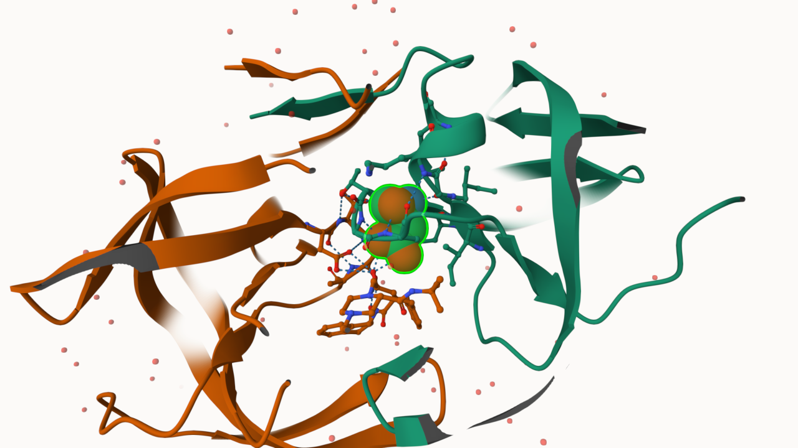
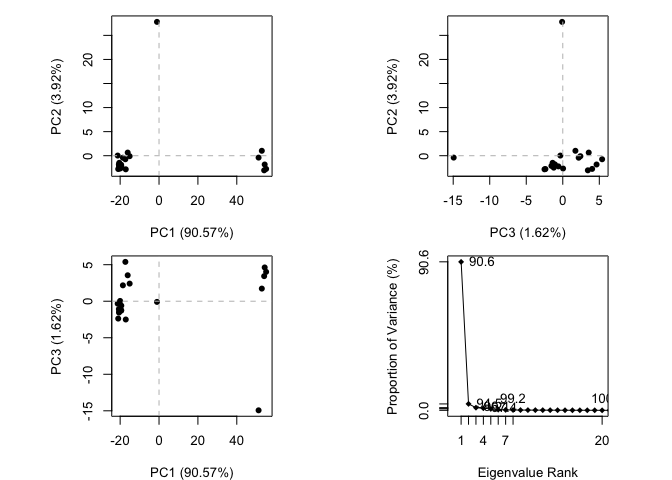
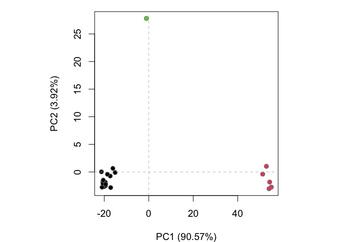
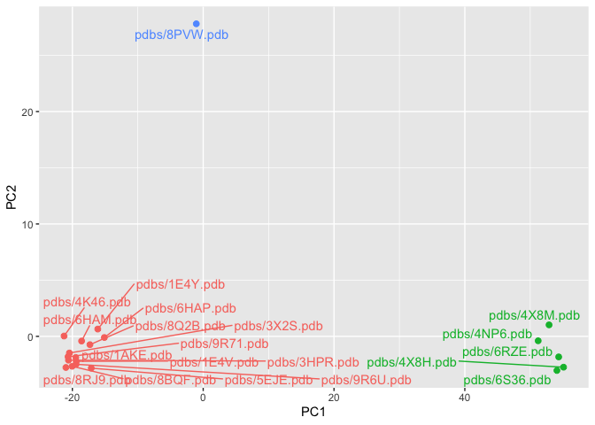
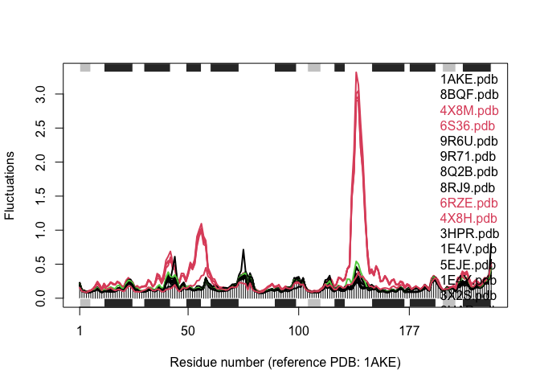

# Class 10: Structural Bioinformatics Part 1
Anisa Mody (PID: A19145291)

- [Background](#background)
- [Introduction to the RCSB Protein Data Bank
  (PDB)](#introduction-to-the-rcsb-protein-data-bank-pdb)
- [Visualizing PDB data with
  Mol-star](#visualizing-pdb-data-with-mol-star)
- [Getting started with the Bio3D
  package](#getting-started-with-the-bio3d-package)
- [Reading PDB file data into R](#reading-pdb-file-data-into-r)
- [Predict the Flexibility of a Given
  Structure](#predict-the-flexibility-of-a-given-structure)
- [Comparative Analysis of the ADK
  Family](#comparative-analysis-of-the-adk-family)
- [Normal Mode Analysis](#normal-mode-analysis)

## Background

The main repository of high-resolution structural data on biomolecules
is called the **Protein Data Bank (PDB)**.

## Introduction to the RCSB Protein Data Bank (PDB)

**PDB Statistics**

What is in the PDB in terms of molecule type and structure determination
method?

Read a CSV file of current PDB stats obtained from
https://www.rcsb.org/stats/summary

``` r
pdb <- read.csv("pdb_stats.csv")
pdb
```

               Molecular.Type  X.ray    EM   NMR Integrative Multiple.methods
    1          Protein (only) 178795 21825 12773         343              226
    2 Protein/Oligosaccharide  10363  3564    34           8               11
    3              Protein/NA   9106  6335   287          24                7
    4     Nucleic acid (only)   3132   221  1566           3               15
    5                   Other    175    25    33           4                0
    6  Oligosaccharide (only)     11     0     6           0                1
      Neutron Other  Total
    1      84    32 214078
    2       1     0  13981
    3       0     0  15759
    4       3     1   4941
    5       0     0    237
    6       0     4     22

> Question 1. What percentage of structures in the PDB are solved by
> X-Ray and Electron Microscopy.

``` r
pdb$X.ray
```

    [1] 178795  10363   9106   3132    175     11

This print out above `pdb$X.ray` is “character”, not “numeric”.
Therefore, we can’t do math with it. We need to fix this…

Two functions that can help here are `sub()` and `as.numeric()`.

``` r
# We want to get rid (or sub out) commas: 
x <- pdb$X.ray
tmp <- sub(",", "", x)
sum(as.numeric(tmp))
```

    [1] 201582

We could make a function to do this:

``` r
rm.comma <- function(x) {
  tmp <- sub(",", "", x)
  sum(as.numeric(tmp))
}
rm.comma(pdb$'X-ray')
```

    [1] 0

``` r
rm.comma(pdb$EM)
```

    [1] 31970

We could also use a different input function for this CSV that speaks
American (i.e. deals with commas in numbers in a comma separated value
file)

``` r
library(readr)

read_csv("pdb_stats.csv")
```

    Rows: 6 Columns: 9
    ── Column specification ────────────────────────────────────────────────────────
    Delimiter: ","
    chr (1): Molecular Type
    dbl (8): X-ray, EM, NMR, Integrative, Multiple methods, Neutron, Other, Total

    ℹ Use `spec()` to retrieve the full column specification for this data.
    ℹ Specify the column types or set `show_col_types = FALSE` to quiet this message.

    # A tibble: 6 × 9
      `Molecular Type`    `X-ray`    EM   NMR Integrative `Multiple methods` Neutron
      <chr>                 <dbl> <dbl> <dbl>       <dbl>              <dbl>   <dbl>
    1 Protein (only)       178795 21825 12773         343                226      84
    2 Protein/Oligosacch…   10363  3564    34           8                 11       1
    3 Protein/NA             9106  6335   287          24                  7       0
    4 Nucleic acid (only)    3132   221  1566           3                 15       3
    5 Other                   175    25    33           4                  0       0
    6 Oligosaccharide (o…      11     0     6           0                  1       0
    # ℹ 2 more variables: Other <dbl>, Total <dbl>

``` r
n.tot <- rm.comma(pdb$Total)
n.xray <- rm.comma(pdb$'X-ray')
n.em <- rm.comma(pdb$EM)

100 * n.xray / n.tot
```

    [1] 0

``` r
n.em / n.tot * 100
```

    [1] 12.83843

87.16% are solved by X-Ray and 12.84% are solved by Electron Microscopy

> Question 2. What proportion of structures in the PDB are protein?

``` r
pdb$Total[1]
```

    [1] 214078

The total number of protein sequences in UniProt is 202,556,314, so we
take the proportion of structures in the PDB, divide by the number of
sequences in UniProt, and multiply by 100.

``` r
(214078/202556314) * 100
```

    [1] 0.1056881

**Key Point**: We have a very, very small structural coverage of known
proteins, approximately ~0.1%. Most structures we know about (~80%) come
from one method, X-ray.

> Q3: Type HIV in the PDB website search box on the home page and
> determine how many HIV-1 protease structures are in the current PDB?

Currently, there are 1,227 HIV-1 protease structures in the PDB.

## Visualizing PDB data with Mol-star

\*\*Visualizing PDB data with Mol-star (Using Mol\*)\*\*

Main stand alone web version with all features is at
https://molstar.org/viewer/


**The Importance of Water**

> Q4: Water molecules normally have 3 atoms. Why do we see just one atom
> per water molecule in this structure?

1HSG is an X-ray diffraction structure at 2.00 Å resolution. Hydrogen is
a very small molecule and thus not resolved in X-ray data, in which one
atom per water molecule is seen (represented by the oxygen atom).

> Q5: There is a critical “conserved” water molecule in the binding
> site. Can you identify this water molecule? What residue number does
> this water molecule have?

Yes, the water molecule is identified on Chain B. The water molecule’s
residue number is HOH 308.

> Q6: Generate and save a figure clearly showing the two distinct chains
> of HIV-protease along with the ligand. You might also consider showing
> the catalytic residues ASP 25 in each chain and the critical water (we
> recommend “Ball & Stick” for these side-chains). Add this figure to
> your Quarto document.



The two multi-colored spacefill models indicate the A and B chain of
ASP25, and the red spacefill model above the ASP25 models is the
critical water molecule.

Discussion Topic: Can you think of a way in which indinavir, or even
larger ligands and substrates, could enter the binding site? Indinavir,
or even larger ligands and substrates, could enter the binding site
through changes in the HIV protease where the two flap regions over the
binding pocket could open and allow access to the exposed active site.

## Getting started with the Bio3D package

Bio3D is an R package fro CRAN for structural bioinformatics.

``` r
library(bio3d)

pdb <- read.pdb("1hsg")
```

      Note: Accessing on-line PDB file

``` r
pdb
```


     Call:  read.pdb(file = "1hsg")

       Total Models#: 1
         Total Atoms#: 1686,  XYZs#: 5058  Chains#: 2  (values: A B)

         Protein Atoms#: 1514  (residues/Calpha atoms#: 198)
         Nucleic acid Atoms#: 0  (residues/phosphate atoms#: 0)

         Non-protein/nucleic Atoms#: 172  (residues: 128)
         Non-protein/nucleic resid values: [ HOH (127), MK1 (1) ]

       Protein sequence:
          PQITLWQRPLVTIKIGGQLKEALLDTGADDTVLEEMSLPGRWKPKMIGGIGGFIKVRQYD
          QILIEICGHKAIGTVLVGPTPVNIIGRNLLTQIGCTLNFPQITLWQRPLVTIKIGGQLKE
          ALLDTGADDTVLEEMSLPGRWKPKMIGGIGGFIKVRQYDQILIEICGHKAIGTVLVGPTP
          VNIIGRNLLTQIGCTLNF

    + attr: atom, xyz, seqres, helix, sheet,
            calpha, remark, call

## Reading PDB file data into R

> Q7: How many amino acid residues are there in this pdb object?

198 amino acid residues.

> Q8: Name one of the two non-protein residues?

HOH (water), or MK1 (ligand).

> Q9: How many protein chains are in this structure?

2 protein chains are in this structure.

``` r
attributes(pdb)
```

    $names
    [1] "atom"   "xyz"    "seqres" "helix"  "sheet"  "calpha" "remark" "call"  

    $class
    [1] "pdb" "sse"

``` r
# For accessing individual attributes
head(pdb$atom)
```

      type eleno elety  alt resid chain resno insert      x      y     z o     b
    1 ATOM     1     N <NA>   PRO     A     1   <NA> 29.361 39.686 5.862 1 38.10
    2 ATOM     2    CA <NA>   PRO     A     1   <NA> 30.307 38.663 5.319 1 40.62
    3 ATOM     3     C <NA>   PRO     A     1   <NA> 29.760 38.071 4.022 1 42.64
    4 ATOM     4     O <NA>   PRO     A     1   <NA> 28.600 38.302 3.676 1 43.40
    5 ATOM     5    CB <NA>   PRO     A     1   <NA> 30.508 37.541 6.342 1 37.87
    6 ATOM     6    CG <NA>   PRO     A     1   <NA> 29.296 37.591 7.162 1 38.40
      segid elesy charge
    1  <NA>     N   <NA>
    2  <NA>     C   <NA>
    3  <NA>     C   <NA>
    4  <NA>     O   <NA>
    5  <NA>     C   <NA>
    6  <NA>     C   <NA>

There are lots of functions that can work with these ‘pdb’ objects:

``` r
head(pdbseq(pdb))
```

      1   2   3   4   5   6 
    "P" "Q" "I" "T" "L" "W" 

We can have a quick interactive view of any of these ‘pdb’ objects:

``` r
library(bio3dview)

view.pdb(pdb)
```

Now, let’s try a custom view:

``` r
view.pdb(pdb, colorScheme="sse", backgroundColor="black")
```

> Question. Create a custom view of HIV-Pr highlighting the active site
> ASP (‘resno=25’), the two chains (in your choice of colors), and the
> ligand all on a custom color background.

``` r
active.site <- atom.select(pdb, resno=25)

library(NGLVieweR)

view.pdb(pdb, 
         cols <- c("coral", "navy"),
         highlight = active.site, 
         backgroundColor = "paleturquoise",
         highlight.style = "spacefill") |>
  setRock()
```

## Predict the Flexibility of a Given Structure

Perform a Normal Mode Analysis (NMA) to predict the flexibility of a
given ‘pdb’ object:

A quick summary of the structure:

``` r
adk <- read.pdb("6s36")
```

      Note: Accessing on-line PDB file
       PDB has ALT records, taking A only, rm.alt=TRUE

``` r
adk
```


     Call:  read.pdb(file = "6s36")

       Total Models#: 1
         Total Atoms#: 1898,  XYZs#: 5694  Chains#: 1  (values: A)

         Protein Atoms#: 1654  (residues/Calpha atoms#: 214)
         Nucleic acid Atoms#: 0  (residues/phosphate atoms#: 0)

         Non-protein/nucleic Atoms#: 244  (residues: 244)
         Non-protein/nucleic resid values: [ CL (3), HOH (238), MG (2), NA (1) ]

       Protein sequence:
          MRIILLGAPGAGKGTQAQFIMEKYGIPQISTGDMLRAAVKSGSELGKQAKDIMDAGKLVT
          DELVIALVKERIAQEDCRNGFLLDGFPRTIPQADAMKEAGINVDYVLEFDVPDELIVDKI
          VGRRVHAPSGRVYHVKFNPPKVEGKDDVTGEELTTRKDDQEETVRKRLVEYHQMTAPLIG
          YYSKEAEAGNTKYAKVDGTKPVAEVRADLEKILG

    + attr: atom, xyz, seqres, helix, sheet,
            calpha, remark, call

``` r
m <- nma(adk)
```

     Building Hessian...        Done in 0.01 seconds.
     Diagonalizing Hessian...   Done in 0.178 seconds.

``` r
plot(m)
```


``` r
view.nma(m)
```

Write out the results for viewing in Mol-star:

``` r
mktrj(m, file="nma.pdb")
```

## Comparative Analysis of the ADK Family

**Setup** Make sure to install packages in console.

> Q10. Which of the packages above is found only on BioConductor and not
> CRAN?

The msa package is found only on BioConductor and not CRAN.

> Q11. Which of the above packages is not found on BioConductor or
> CRAN?:

The package “bio3dview” is not found on BioConductor or CRAN.

> Q12. True or False? Functions from the pak package can be used to
> install packages from GitHub and BitBucket?

True.

**Search and Retrieve ADK Structures**

Our first step is to find a sequence for this family. We will use the
database ID `1ake_A` here:

``` r
library(bio3d)
aa <- get.seq("1ake_A")
```

    Warning in get.seq("1ake_A"): Removing existing file: seqs.fasta

    Fetching... Please wait. Done.

``` r
id <- "1ake_A"
```

``` r
aa
```

                 1        .         .         .         .         .         60 
    pdb|1AKE|A   MRIILLGAPGAGKGTQAQFIMEKYGIPQISTGDMLRAAVKSGSELGKQAKDIMDAGKLVT
                 1        .         .         .         .         .         60 

                61        .         .         .         .         .         120 
    pdb|1AKE|A   DELVIALVKERIAQEDCRNGFLLDGFPRTIPQADAMKEAGINVDYVLEFDVPDELIVDRI
                61        .         .         .         .         .         120 

               121        .         .         .         .         .         180 
    pdb|1AKE|A   VGRRVHAPSGRVYHVKFNPPKVEGKDDVTGEELTTRKDDQEETVRKRLVEYHQMTAPLIG
               121        .         .         .         .         .         180 

               181        .         .         .   214 
    pdb|1AKE|A   YYSKEAEAGNTKYAKVDGTKPVAEVRADLEKILG
               181        .         .         .   214 

    Call:
      read.fasta(file = outfile)

    Class:
      fasta

    Alignment dimensions:
      1 sequence rows; 214 position columns (214 non-gap, 0 gap) 

    + attr: id, ali, call

> Q13. How many amino acids are in this sequence, i.e. how long is this
> sequence?

There are 214 amino acids in this sequence.

Search for any related sequences in the database:

``` r
blast <- blast.pdb(aa)
```

     Searching ... please wait (updates every 5 seconds) RID = 1ES4KWV8014 
     ...........
     Reporting 96 hits

``` r
head(blast$hit.tbl)
```

            queryid subjectids identity alignmentlength mismatches gapopens q.start
    1 Query_7550537     1AKE_A  100.000             214          0        0       1
    2 Query_7550537     8BQF_A   99.533             214          1        0       1
    3 Query_7550537     4X8M_A   99.533             214          1        0       1
    4 Query_7550537     6S36_A   99.533             214          1        0       1
    5 Query_7550537     9R6U_A   99.533             214          1        0       1
    6 Query_7550537     9R71_A   99.533             214          1        0       1
      q.end s.start s.end    evalue bitscore positives mlog.evalue pdb.id    acc
    1   214       1   214 1.82e-156      432    100.00    358.6044 1AKE_A 1AKE_A
    2   214      21   234 2.98e-156      433    100.00    358.1114 8BQF_A 8BQF_A
    3   214       1   214 3.26e-156      432    100.00    358.0215 4X8M_A 4X8M_A
    4   214       1   214 4.78e-156      432    100.00    357.6388 6S36_A 6S36_A
    5   214       1   214 1.07e-155      431     99.53    356.8330 9R6U_A 9R6U_A
    6   214       1   214 1.26e-155      431     99.53    356.6696 9R71_A 9R71_A

``` r
hits <- plot(blast)
```

      * Possible cutoff values:    260 3 
                Yielding Nhits:    20 96 

      * Chosen cutoff value of:    260 
                Yielding Nhits:    20 


``` r
head(hits$pdb.id)
```

    [1] "1AKE_A" "8BQF_A" "4X8M_A" "6S36_A" "9R6U_A" "9R71_A"

``` r
files <- get.pdb(hits$pdb.id, path="pdbs")
```

    Warning in get.pdb(hits$pdb.id, path = "pdbs"): pdbs/1AKE.pdb exists. Skipping
    download

    Warning in get.pdb(hits$pdb.id, path = "pdbs"): pdbs/8BQF.pdb exists. Skipping
    download

    Warning in get.pdb(hits$pdb.id, path = "pdbs"): pdbs/4X8M.pdb exists. Skipping
    download

    Warning in get.pdb(hits$pdb.id, path = "pdbs"): pdbs/6S36.pdb exists. Skipping
    download

    Warning in get.pdb(hits$pdb.id, path = "pdbs"): pdbs/9R6U.pdb exists. Skipping
    download

    Warning in get.pdb(hits$pdb.id, path = "pdbs"): pdbs/9R71.pdb exists. Skipping
    download

    Warning in get.pdb(hits$pdb.id, path = "pdbs"): pdbs/8Q2B.pdb exists. Skipping
    download

    Warning in get.pdb(hits$pdb.id, path = "pdbs"): pdbs/8RJ9.pdb exists. Skipping
    download

    Warning in get.pdb(hits$pdb.id, path = "pdbs"): pdbs/6RZE.pdb exists. Skipping
    download

    Warning in get.pdb(hits$pdb.id, path = "pdbs"): pdbs/4X8H.pdb exists. Skipping
    download

    Warning in get.pdb(hits$pdb.id, path = "pdbs"): pdbs/3HPR.pdb exists. Skipping
    download

    Warning in get.pdb(hits$pdb.id, path = "pdbs"): pdbs/1E4V.pdb exists. Skipping
    download

    Warning in get.pdb(hits$pdb.id, path = "pdbs"): pdbs/5EJE.pdb exists. Skipping
    download

    Warning in get.pdb(hits$pdb.id, path = "pdbs"): pdbs/1E4Y.pdb exists. Skipping
    download

    Warning in get.pdb(hits$pdb.id, path = "pdbs"): pdbs/3X2S.pdb exists. Skipping
    download

    Warning in get.pdb(hits$pdb.id, path = "pdbs"): pdbs/6HAP.pdb exists. Skipping
    download

    Warning in get.pdb(hits$pdb.id, path = "pdbs"): pdbs/6HAM.pdb exists. Skipping
    download

    Warning in get.pdb(hits$pdb.id, path = "pdbs"): pdbs/8PVW.pdb exists. Skipping
    download

    Warning in get.pdb(hits$pdb.id, path = "pdbs"): pdbs/4K46.pdb exists. Skipping
    download

    Warning in get.pdb(hits$pdb.id, path = "pdbs"): pdbs/4NP6.pdb exists. Skipping
    download

Align and superpose all these ADK structures:

``` r
pdbs <- pdbaln(files, fit = TRUE, exefile="msa")
```

    Reading PDB files:
    pdbs/1AKE.pdb
    pdbs/8BQF.pdb
    pdbs/4X8M.pdb
    pdbs/6S36.pdb
    pdbs/9R6U.pdb
    pdbs/9R71.pdb
    pdbs/8Q2B.pdb
    pdbs/8RJ9.pdb
    pdbs/6RZE.pdb
    pdbs/4X8H.pdb
    pdbs/3HPR.pdb
    pdbs/1E4V.pdb
    pdbs/5EJE.pdb
    pdbs/1E4Y.pdb
    pdbs/3X2S.pdb
    pdbs/6HAP.pdb
    pdbs/6HAM.pdb
    pdbs/8PVW.pdb
    pdbs/4K46.pdb
    pdbs/4NP6.pdb
       PDB has ALT records, taking A only, rm.alt=TRUE
    .   PDB has ALT records, taking A only, rm.alt=TRUE
    ..   PDB has ALT records, taking A only, rm.alt=TRUE
    .   PDB has ALT records, taking A only, rm.alt=TRUE
    .   PDB has ALT records, taking A only, rm.alt=TRUE
    .   PDB has ALT records, taking A only, rm.alt=TRUE
    .   PDB has ALT records, taking A only, rm.alt=TRUE
    .   PDB has ALT records, taking A only, rm.alt=TRUE
    ..   PDB has ALT records, taking A only, rm.alt=TRUE
    ..   PDB has ALT records, taking A only, rm.alt=TRUE
    ....   PDB has ALT records, taking A only, rm.alt=TRUE
    .   PDB has ALT records, taking A only, rm.alt=TRUE
    .   PDB has ALT records, taking A only, rm.alt=TRUE
    .   PDB has ALT records, taking A only, rm.alt=TRUE
    .

    Extracting sequences

    pdb/seq: 1   name: pdbs/1AKE.pdb 
       PDB has ALT records, taking A only, rm.alt=TRUE
    pdb/seq: 2   name: pdbs/8BQF.pdb 
       PDB has ALT records, taking A only, rm.alt=TRUE
    pdb/seq: 3   name: pdbs/4X8M.pdb 
    pdb/seq: 4   name: pdbs/6S36.pdb 
       PDB has ALT records, taking A only, rm.alt=TRUE
    pdb/seq: 5   name: pdbs/9R6U.pdb 
       PDB has ALT records, taking A only, rm.alt=TRUE
    pdb/seq: 6   name: pdbs/9R71.pdb 
       PDB has ALT records, taking A only, rm.alt=TRUE
    pdb/seq: 7   name: pdbs/8Q2B.pdb 
       PDB has ALT records, taking A only, rm.alt=TRUE
    pdb/seq: 8   name: pdbs/8RJ9.pdb 
       PDB has ALT records, taking A only, rm.alt=TRUE
    pdb/seq: 9   name: pdbs/6RZE.pdb 
       PDB has ALT records, taking A only, rm.alt=TRUE
    pdb/seq: 10   name: pdbs/4X8H.pdb 
    pdb/seq: 11   name: pdbs/3HPR.pdb 
       PDB has ALT records, taking A only, rm.alt=TRUE
    pdb/seq: 12   name: pdbs/1E4V.pdb 
    pdb/seq: 13   name: pdbs/5EJE.pdb 
       PDB has ALT records, taking A only, rm.alt=TRUE
    pdb/seq: 14   name: pdbs/1E4Y.pdb 
    pdb/seq: 15   name: pdbs/3X2S.pdb 
    pdb/seq: 16   name: pdbs/6HAP.pdb 
    pdb/seq: 17   name: pdbs/6HAM.pdb 
       PDB has ALT records, taking A only, rm.alt=TRUE
    pdb/seq: 18   name: pdbs/8PVW.pdb 
       PDB has ALT records, taking A only, rm.alt=TRUE
    pdb/seq: 19   name: pdbs/4K46.pdb 
       PDB has ALT records, taking A only, rm.alt=TRUE
    pdb/seq: 20   name: pdbs/4NP6.pdb 
       PDB has ALT records, taking A only, rm.alt=TRUE

``` r
view.pdbs(pdbs)
```

PCA of all this structural data:

``` r
pc <- pca(pdbs)
plot(pc)
```



``` r
plot(pc, 1:2)
```


Note: Function rmsd() faciliates clustering analysis based on pairwise
struc- tural deviation

``` r
# Calculate RMSD
rd <- rmsd(pdbs)
```

    Warning in rmsd(pdbs): No indices provided, using the 187 non NA positions

``` r
# Structure-based clustering
hc.rd <- hclust(dist(rd))
grps.rd <- cutree(hc.rd, k=3)
plot(pc, 1:2, col="grey50", bg=grps.rd, pch=21, cex=1)
```



**PCA Visualization**

``` r
# Visualize first principal component
pc1 <- mktrj(pc, pc=1, file="pc_1.pdb")
pc1
```


       Total Frames#: 34
       Total XYZs#:   561,  (Atoms#:  187)

        [1]  13.27  5.599  -0.55  <...>  24.029  5.669  -3.458  [19074] 

    + attr: Matrix DIM = 34 x 561

Interactive view of the PC1 captured structural differences:

``` r
view.pca(pc)
```

``` r
mktrj(pc, file = "pca.pdb")
```

We can also plot our main PCA results with ggplot:

``` r
#Plotting results with ggplot2
library(ggplot2)
```

``` r
library(ggrepel)
```

``` r
df <- data.frame(PC1=pc$z[,1],
PC2=pc$z[,2],
col=as.factor(grps.rd),
ids=ids <- pdbs$id)
p <- ggplot(df) +
aes(PC1, PC2, col=col, label=ids) +
geom_point(size=2) +
geom_text_repel(max.overlaps = 20) +
theme(legend.position = "none")
p
```



## Normal Mode Analysis

``` r
modes <- nma(pdbs)
```

    Warning in nma.pdbs(pdbs): 1AKE.pdb, 8BQF.pdb, 9R6U.pdb, 9R71.pdb, 8Q2B.pdb, 8RJ9.pdb, 3HPR.pdb, 1E4V.pdb, 5EJE.pdb, 1E4Y.pdb, 3X2S.pdb, 4NP6.pdb might have missing residue(s) in structure:
       Fluctuations at neighboring positions may be affected.


    Details of Scheduled Calculation:
      ... 20 input structures 
      ... storing 555 eigenvectors for each structure 
      ... dimension of x$U.subspace: ( 561x555x20 )
      ... coordinate superposition prior to NM calculation 
      ... aligned eigenvectors (gap containing positions removed)  
      ... estimated memory usage of final 'eNMA' object: 47.6 Mb 


      |                                                                            
      |                                                                      |   0%
      |                                                                            
      |====                                                                  |   5%
      |                                                                            
      |=======                                                               |  10%
      |                                                                            
      |==========                                                            |  15%
      |                                                                            
      |==============                                                        |  20%
      |                                                                            
      |==================                                                    |  25%
      |                                                                            
      |=====================                                                 |  30%
      |                                                                            
      |========================                                              |  35%
      |                                                                            
      |============================                                          |  40%
      |                                                                            
      |================================                                      |  45%
      |                                                                            
      |===================================                                   |  50%
      |                                                                            
      |======================================                                |  55%
      |                                                                            
      |==========================================                            |  60%
      |                                                                            
      |==============================================                        |  65%
      |                                                                            
      |=================================================                     |  70%
      |                                                                            
      |====================================================                  |  75%
      |                                                                            
      |========================================================              |  80%
      |                                                                            
      |============================================================          |  85%
      |                                                                            
      |===============================================================       |  90%
      |                                                                            
      |==================================================================    |  95%
      |                                                                            
      |======================================================================| 100%

``` r
plot(modes, pdbs, col=grps.rd)
```

    Extracting SSE from pdbs$sse attribute



> Q14. What do you note about this plot? Are the black and colored lines
> similar or different? Where do you think they differ most and why?

The black and colored lines are similar because they follow the same
overall fluctuation pattern across most residue positions. However, the
colored lines show much larger fluctuations at certain regions,
especially around residues 45–60 and most noticeably near residue 130,
where there is a very large spike. The greatest differences occur around
residue 130 because the colored structures appear to have much more
movement or flexibility in that region compared to the black structures.
This could indicate a conformational change, a flexible loop region, or
structural differences between the groups of proteins being compared.
