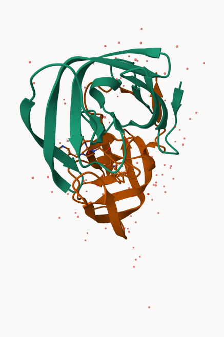
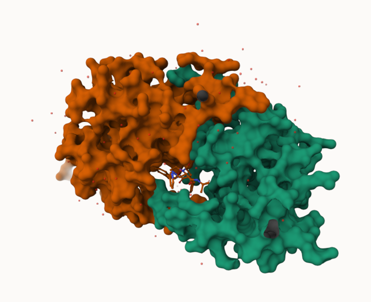
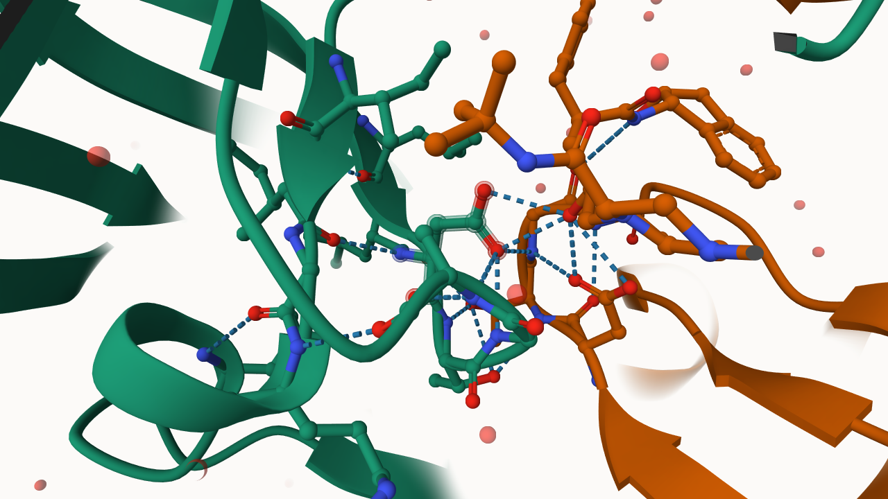

## Background

The main repository of high-resolution structural data on biomolecules
is called the **Protein Data Bank (PDB)**.

## Introduction to the RCSB Protein Data Bank (PDB)

**PDB Statistics**

What is in the PDB in terms of molecule type and structure determination
method?

Read a CSV file of current PDB stats obtained from
https://www.rcsb.org/stats/summary

```{r}
pdb <- read.csv("pdb_stats.csv")
pdb
```

> Question 1. What percentage of structures in the PDB are solved by
> X-Ray and Electron Microscopy.

```{r}
pdb$X.ray
```

This print out above `pdb$X.ray` is “character”, not “numeric”.
Therefore, we can’t do math with it. We need to fix this…

Two functions that can help here are `sub()` and `as.numeric()`.

```{r}
# We want to get rid (or sub out) commas: 
x <- pdb$X.ray
tmp <- sub(",", "", x)
sum(as.numeric(tmp))
```

We could make a function to do this:

```{r}
rm.comma <- function(x) {
  tmp <- sub(",", "", x)
  sum(as.numeric(tmp))
}
rm.comma(pdb$'X-ray')
```

```{r}
rm.comma(pdb$EM)
```

We could also use a different input function for this CSV that speaks
American (i.e. deals with commas in numbers in a comma separated value
file)

```{r}
library(readr)

read_csv("pdb_stats.csv")
```

```{r}
n.tot <- rm.comma(pdb$Total)
n.xray <- rm.comma(pdb$'X-ray')
n.em <- rm.comma(pdb$EM)

100 * n.xray / n.tot
```

```{r}
n.em / n.tot * 100
```

87.16% are solved by X-Ray and 12.84% are solved by Electron Microscopy

> Question 2. What proportion of structures in the PDB are protein?

```{r}
pdb$Total[1]
```

The total number of protein sequences in UniProt is 202,556,314, so we
take the proportion of structures in the PDB, divide by the number of
sequences in UniProt, and multiply by 100.

```{r}
(214078/202556314) * 100
```

**Key Point**: We have a very, very small structural coverage of known
proteins, approximately \~0.1%. Most structures we know about (\~80%)
come from one method, X-ray.

> Q3: Type HIV in the PDB website search box on the home page and
> determine how many HIV-1 protease structures are in the current PDB?

Currently, there are 1,227 HIV-1 protease structures in the PDB.

## Visualizing PDB data with Mol-star

\*\*Visualizing PDB data with Mol-star (Using Mol\*)\*\*

Main stand alone web version with all features is at
https://molstar.org/viewer/








**The Importance of Water**

> Q4: Water molecules normally have 3 atoms. Why do we see just one atom
> per water molecule in this structure?

1HSG is an X-ray diffraction structure at 2.00 Å resolution. Hydrogen is
a very small molecule and thus not resolved in X-ray data, in which one
atom per water molecule is seen (represented by the oxygen atom).

> Q5: There is a critical “conserved” water molecule in the binding
> site. Can you identify this water molecule? What residue number does
> this water molecule have?

Yes, the water molecule is identified on Chain B. The water molecule’s
residue number is HOH 308.

> Q6: Generate and save a figure clearly showing the two distinct chains
> of HIV-protease along with the ligand. You might also consider showing
> the catalytic residues ASP 25 in each chain and the critical water (we
> recommend “Ball & Stick” for these side-chains). Add this figure to
> your Quarto document.


The two multi-colored spacefill models indicate the A and B chain of ASP25, and the red spacefill model above the ASP25 models is the critical water molecule.

Discussion Topic: Can you think of a way in which indinavir, or even larger ligands and substrates, could enter the binding site? 
Indinavir, or even larger ligands and substrates, could enter the binding site through changes in the HIV protease where the two flap regions over the binding pocket could open and allow access to the exposed active site.

## Getting started with the Bio3D package

Bio3D is an R package fro CRAN for structural bioinformatics.

```{r}
library(bio3d)

pdb <- read.pdb("1hsg")
pdb
```

## Reading PDB file data into R

> Q7: How many amino acid residues are there in this pdb object?

198 amino acid residues.

> Q8: Name one of the two non-protein residues?

HOH (water), or MK1 (ligand).

> Q9: How many protein chains are in this structure?

2 protein chains are in this structure.

```{r}
attributes(pdb)
```

```{r}
# For accessing individual attributes
head(pdb$atom)
```

There are lots of functions that can work with these ‘pdb’ objects:

```{r}
head(pdbseq(pdb))
```

We can have a quick interactive view of any of these ‘pdb’ objects:

```{r}
#| eval: false
library(bio3dview)

view.pdb(pdb)
```

Now, let’s try a custom view:

```{r}
#| eval: false
view.pdb(pdb, colorScheme="sse", backgroundColor="black")
```

> Question. Create a custom view of HIV-Pr highlighting the active site
> ASP (‘resno=25’), the two chains (in your choice of colors), and the
> ligand all on a custom color background.

```{r}
#| eval: false
active.site <- atom.select(pdb, resno=25)

library(NGLVieweR)

view.pdb(pdb, 
         cols <- c("coral", "navy"),
         highlight = active.site, 
         backgroundColor = "paleturquoise",
         highlight.style = "spacefill") |>
  setRock()
```

## Predict the Flexibility of a Given Structure

Perform a Normal Mode Analysis (NMA) to predict the flexibility of a
given ‘pdb’ object:

A quick summary of the structure:

```{r}
adk <- read.pdb("6s36")
adk
```

```{r}
m <- nma(adk)
```

```{r}
plot(m)
```

```{r}
#| eval: false
view.nma(m)
```

Write out the results for viewing in Mol-star:

```{r}
mktrj(m, file="nma.pdb")
```

## Comparative Analysis of the ADK Family

**Setup** Make sure to install packages in console.

> Q10. Which of the packages above is found only on BioConductor and not
> CRAN?

The msa package is found only on BioConductor and not CRAN.

> Q11. Which of the above packages is not found on BioConductor or
> CRAN?:

The package “bio3dview” is not found on BioConductor or CRAN.

> Q12. True or False? Functions from the pak package can be used to
> install packages from GitHub and BitBucket?

True.

**Search and Retrieve ADK Structures**

Our first step is to find a sequence for this family. We will use the
database ID `1ake_A` here:

```{r}
library(bio3d)
aa <- get.seq("1ake_A")
id <- "1ake_A"
```

```{r}
aa
```

> Q13. How many amino acids are in this sequence, i.e. how long is this
> sequence?

There are 214 amino acids in this sequence.

Search for any related sequences in the database:

```{r}
blast <- blast.pdb(aa)
```

```{r}
head(blast$hit.tbl)
```

```{r}
hits <- plot(blast)
```

```{r}
head(hits$pdb.id)
```

```{r}
files <- get.pdb(hits$pdb.id, path="pdbs")
```

Align and superpose all these ADK structures:

```{r}
pdbs <- pdbaln(files, fit = TRUE, exefile="msa")
```

```{r}
#| eval: false
view.pdbs(pdbs)
```

PCA of all this structural data:

```{r}
pc <- pca(pdbs)
plot(pc)
```

```{r}
plot(pc, 1:2)
```

Note: Function rmsd() faciliates clustering analysis based on pairwise
struc- tural deviation

```{r}
# Calculate RMSD
rd <- rmsd(pdbs)
```

```{r}
# Structure-based clustering
hc.rd <- hclust(dist(rd))
grps.rd <- cutree(hc.rd, k=3)
plot(pc, 1:2, col="grey50", bg=grps.rd, pch=21, cex=1)
```

**PCA Visualization**

```{r}
# Visualize first principal component
pc1 <- mktrj(pc, pc=1, file="pc_1.pdb")
pc1
```

Interactive view of the PC1 captured structural differences:

```{r}
#| eval: false
view.pca(pc)
```

```{r}
mktrj(pc, file = "pca.pdb")
```

We can also plot our main PCA results with ggplot:

```{r}
#Plotting results with ggplot2
library(ggplot2)
```

```{r}
library(ggrepel)
```

```{r}
df <- data.frame(PC1=pc$z[,1],
PC2=pc$z[,2],
col=as.factor(grps.rd),
ids=ids <- pdbs$id)
p <- ggplot(df) +
aes(PC1, PC2, col=col, label=ids) +
geom_point(size=2) +
geom_text_repel(max.overlaps = 20) +
theme(legend.position = "none")
p
```

## Normal Mode Analysis

```{r}
modes <- nma(pdbs)
```

```{r}
plot(modes, pdbs, col=grps.rd)
```

> Q14. What do you note about this plot? Are the black and colored lines
> similar or different? Where do you think they differ most and why?

The black and colored lines are similar because they follow the same
overall fluctuation pattern across most residue positions. However, the
colored lines show much larger fluctuations at certain regions,
especially around residues 45–60 and most noticeably near residue 130,
where there is a very large spike. The greatest differences occur around
residue 130 because the colored structures appear to have much more
movement or flexibility in that region compared to the black structures.
This could indicate a conformational change, a flexible loop region, or
structural differences between the groups of proteins being compared.
