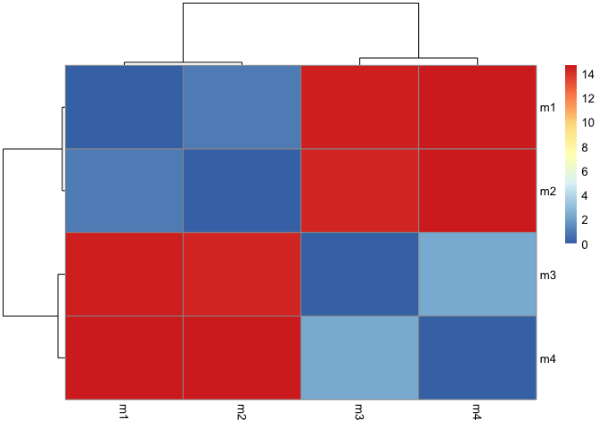
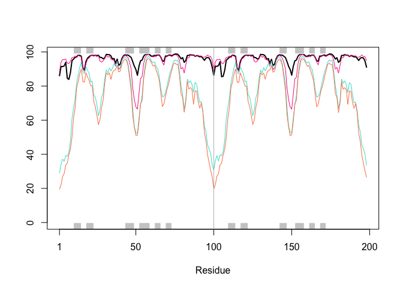
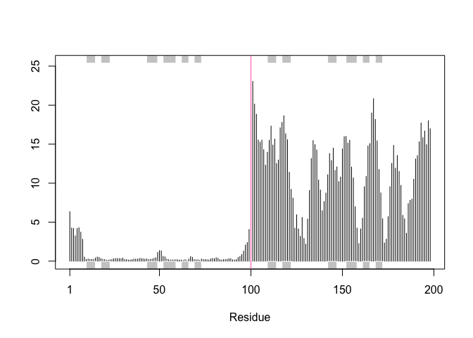
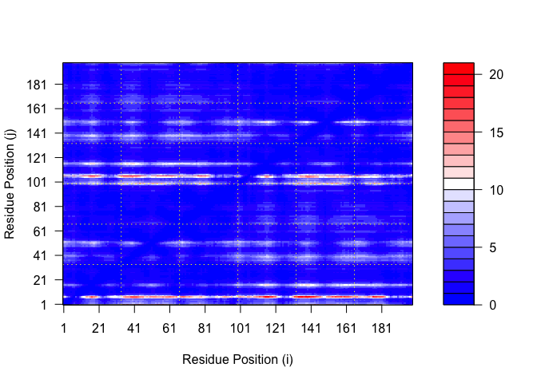
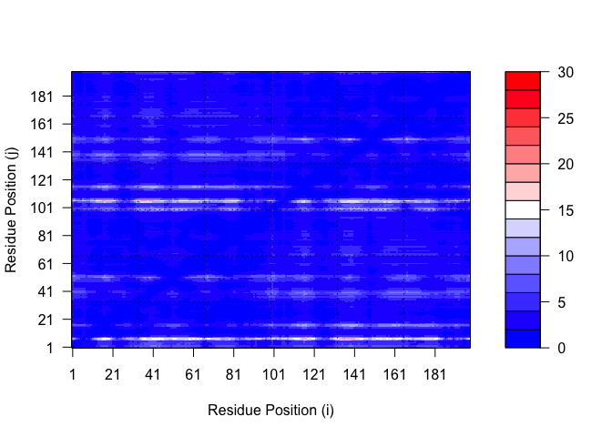

# Class 11: AlphaFold
Anisa Mody (PID: A19145291)

- [Background](#background)
- [Custom Analysis of Resulting
  Models](#custom-analysis-of-resulting-models)
- [Predicted Alignment Error for
  Domains](#predicted-alignment-error-for-domains)
- [Comparing PAE Plots](#comparing-pae-plots)
- [Residue Conservation from Alignment
  File](#residue-conservation-from-alignment-file)

## Background

In this hands-on session we will utilize **AlphaFold** to predict
protein structure from sequence (Jumper et al. 2021).

## Custom Analysis of Resulting Models

``` r
library(bio3d)

pdb <- read.pdb("HIVPrDimer_23119_unrelaxed_rank_001_alphafold2_multimer_v3_model_4_seed_000.pdb")

pdb
```


     Call:  read.pdb(file = "HIVPrDimer_23119_unrelaxed_rank_001_alphafold2_multimer_v3_model_4_seed_000.pdb")

       Total Models#: 1
         Total Atoms#: 1514,  XYZs#: 4542  Chains#: 2  (values: A B)

         Protein Atoms#: 1514  (residues/Calpha atoms#: 198)
         Nucleic acid Atoms#: 0  (residues/phosphate atoms#: 0)

         Non-protein/nucleic Atoms#: 0  (residues: 0)
         Non-protein/nucleic resid values: [ none ]

       Protein sequence:
          PQITLWQRPLVTIKIGGQLKEALLDTGADDTVLEEMSLPGRWKPKMIGGIGGFIKVRQYD
          QILIEICGHKAIGTVLVGPTPVNIIGRNLLTQIGCTLNFPQITLWQRPLVTIKIGGQLKE
          ALLDTGADDTVLEEMSLPGRWKPKMIGGIGGFIKVRQYDQILIEICGHKAIGTVLVGPTP
          VNIIGRNLLTQIGCTLNF

    + attr: atom, xyz, calpha, call

Make a vector of input PDB file names that we can read into R:

``` r
pdb_files <- list.files("HIVPrDimer_23119",
pattern =".pdb",
full.names = TRUE)
basename(pdb_files)
```

    [1] "HIVPrDimer_23119_unrelaxed_rank_002_alphafold2_multimer_v3_model_1_seed_000.pdb"
    [2] "HIVPrDimer_23119_unrelaxed_rank_003_alphafold2_multimer_v3_model_5_seed_000.pdb"
    [3] "HIVPrDimer_23119_unrelaxed_rank_004_alphafold2_multimer_v3_model_2_seed_000.pdb"
    [4] "HIVPrDimer_23119_unrelaxed_rank_005_alphafold2_multimer_v3_model_3_seed_000.pdb"

``` r
# Read all data from Models and superpose/fit coords

pdbs <- pdbaln(pdb_files, fit=TRUE, exefile="msa")
```

    Reading PDB files:
    HIVPrDimer_23119/HIVPrDimer_23119_unrelaxed_rank_002_alphafold2_multimer_v3_model_1_seed_000.pdb
    HIVPrDimer_23119/HIVPrDimer_23119_unrelaxed_rank_003_alphafold2_multimer_v3_model_5_seed_000.pdb
    HIVPrDimer_23119/HIVPrDimer_23119_unrelaxed_rank_004_alphafold2_multimer_v3_model_2_seed_000.pdb
    HIVPrDimer_23119/HIVPrDimer_23119_unrelaxed_rank_005_alphafold2_multimer_v3_model_3_seed_000.pdb
    ....

    Extracting sequences

    pdb/seq: 1   name: HIVPrDimer_23119/HIVPrDimer_23119_unrelaxed_rank_002_alphafold2_multimer_v3_model_1_seed_000.pdb 
    pdb/seq: 2   name: HIVPrDimer_23119/HIVPrDimer_23119_unrelaxed_rank_003_alphafold2_multimer_v3_model_5_seed_000.pdb 
    pdb/seq: 3   name: HIVPrDimer_23119/HIVPrDimer_23119_unrelaxed_rank_004_alphafold2_multimer_v3_model_2_seed_000.pdb 
    pdb/seq: 4   name: HIVPrDimer_23119/HIVPrDimer_23119_unrelaxed_rank_005_alphafold2_multimer_v3_model_3_seed_000.pdb 

``` r
pdbs
```

                                   1        .         .         .         .         50 
    [Truncated_Name:1]HIVPrDimer   PQITLWQRPLVTIKIGGQLKEALLDTGADDTVLEEMSLPGRWKPKMIGGI
    [Truncated_Name:2]HIVPrDimer   PQITLWQRPLVTIKIGGQLKEALLDTGADDTVLEEMSLPGRWKPKMIGGI
    [Truncated_Name:3]HIVPrDimer   PQITLWQRPLVTIKIGGQLKEALLDTGADDTVLEEMSLPGRWKPKMIGGI
    [Truncated_Name:4]HIVPrDimer   PQITLWQRPLVTIKIGGQLKEALLDTGADDTVLEEMSLPGRWKPKMIGGI
                                   ************************************************** 
                                   1        .         .         .         .         50 

                                  51        .         .         .         .         100 
    [Truncated_Name:1]HIVPrDimer   GGFIKVRQYDQILIEICGHKAIGTVLVGPTPVNIIGRNLLTQIGCTLNFP
    [Truncated_Name:2]HIVPrDimer   GGFIKVRQYDQILIEICGHKAIGTVLVGPTPVNIIGRNLLTQIGCTLNFP
    [Truncated_Name:3]HIVPrDimer   GGFIKVRQYDQILIEICGHKAIGTVLVGPTPVNIIGRNLLTQIGCTLNFP
    [Truncated_Name:4]HIVPrDimer   GGFIKVRQYDQILIEICGHKAIGTVLVGPTPVNIIGRNLLTQIGCTLNFP
                                   ************************************************** 
                                  51        .         .         .         .         100 

                                 101        .         .         .         .         150 
    [Truncated_Name:1]HIVPrDimer   QITLWQRPLVTIKIGGQLKEALLDTGADDTVLEEMSLPGRWKPKMIGGIG
    [Truncated_Name:2]HIVPrDimer   QITLWQRPLVTIKIGGQLKEALLDTGADDTVLEEMSLPGRWKPKMIGGIG
    [Truncated_Name:3]HIVPrDimer   QITLWQRPLVTIKIGGQLKEALLDTGADDTVLEEMSLPGRWKPKMIGGIG
    [Truncated_Name:4]HIVPrDimer   QITLWQRPLVTIKIGGQLKEALLDTGADDTVLEEMSLPGRWKPKMIGGIG
                                   ************************************************** 
                                 101        .         .         .         .         150 

                                 151        .         .         .         .       198 
    [Truncated_Name:1]HIVPrDimer   GFIKVRQYDQILIEICGHKAIGTVLVGPTPVNIIGRNLLTQIGCTLNF
    [Truncated_Name:2]HIVPrDimer   GFIKVRQYDQILIEICGHKAIGTVLVGPTPVNIIGRNLLTQIGCTLNF
    [Truncated_Name:3]HIVPrDimer   GFIKVRQYDQILIEICGHKAIGTVLVGPTPVNIIGRNLLTQIGCTLNF
    [Truncated_Name:4]HIVPrDimer   GFIKVRQYDQILIEICGHKAIGTVLVGPTPVNIIGRNLLTQIGCTLNF
                                   ************************************************ 
                                 151        .         .         .         .       198 

    Call:
      pdbaln(files = pdb_files, fit = TRUE, exefile = "msa")

    Class:
      pdbs, fasta

    Alignment dimensions:
      4 sequence rows; 198 position columns (198 non-gap, 0 gap) 

    + attr: xyz, resno, b, chain, id, ali, resid, sse, call

``` r
rd <- rmsd(pdbs, fit=T)
```

    Warning in rmsd(pdbs, fit = T): No indices provided, using the 198 non NA positions

``` r
range(rd)
```

    [1]  0.000 14.686

``` r
library(pheatmap)
colnames(rd) <- paste0("m",1:4)
rownames(rd) <- paste0("m",1:4)
pheatmap(rd)
```



The RMSD heatmap compares structural similarity among the four AlphaFold
models. Lower RMSD values indicate models with more similar predicted
structures, while higher RMSD values reflect greater structural
differences between the models. The clustering pattern suggests that
models m1 and m2 are most similar to each other, as are models m3 and
m4, forming two major structural groups.

``` r
pdb <- read.pdb("1hsg")
```

      Note: Accessing on-line PDB file

``` r
plotb3(pdbs$b[1,], typ="l", lwd=2, sse=pdb)

points(pdbs$b[2,], typ="l", col="deeppink")
points(pdbs$b[3,], typ="l", col="turquoise")
points(pdbs$b[4,], typ="l", col="coral")
abline(v=100, col="gray")
```



The pLDDT plot illustrates AlphaFold confidence scores across residue
positions for the four predicted models. Higher pLDDT values indicate
regions of greater structural confidence, while lower values suggest
areas of reduced prediction reliability or increased flexibility.
Overall, most residues show high confidence, with noticeable drops in
specific regions that may correspond to flexible loops, domain
boundaries, or structurally uncertain segments.

``` r
core <- core.find(pdbs)
```

     core size 197 of 198  vol = 9989.779 
     core size 196 of 198  vol = 2193.35 
     core size 195 of 198  vol = 916.817 
     core size 194 of 198  vol = 803.576 
     core size 193 of 198  vol = 706.897 
     core size 192 of 198  vol = 638.424 
     core size 191 of 198  vol = 597.402 
     core size 190 of 198  vol = 567.143 
     core size 189 of 198  vol = 537.176 
     core size 188 of 198  vol = 506.427 
     core size 187 of 198  vol = 475.311 
     core size 186 of 198  vol = 444.447 
     core size 185 of 198  vol = 417.344 
     core size 184 of 198  vol = 390.321 
     core size 183 of 198  vol = 363.34 
     core size 182 of 198  vol = 344.051 
     core size 181 of 198  vol = 322.07 
     core size 180 of 198  vol = 299.703 
     core size 179 of 198  vol = 281.569 
     core size 178 of 198  vol = 267.501 
     core size 177 of 198  vol = 257.419 
     core size 176 of 198  vol = 245.98 
     core size 175 of 198  vol = 235.06 
     core size 174 of 198  vol = 224.504 
     core size 173 of 198  vol = 200.749 
     core size 172 of 198  vol = 191.609 
     core size 171 of 198  vol = 182.108 
     core size 170 of 198  vol = 173.858 
     core size 169 of 198  vol = 167.26 
     core size 168 of 198  vol = 161.254 
     core size 167 of 198  vol = 155.295 
     core size 166 of 198  vol = 149.239 
     core size 165 of 198  vol = 138.944 
     core size 164 of 198  vol = 134.578 
     core size 163 of 198  vol = 130.244 
     core size 162 of 198  vol = 125.771 
     core size 161 of 198  vol = 121.537 
     core size 160 of 198  vol = 111.16 
     core size 159 of 198  vol = 107.48 
     core size 158 of 198  vol = 104.594 
     core size 157 of 198  vol = 102.081 
     core size 156 of 198  vol = 99.832 
     core size 155 of 198  vol = 95.284 
     core size 154 of 198  vol = 92.997 
     core size 153 of 198  vol = 90.807 
     core size 152 of 198  vol = 88.386 
     core size 151 of 198  vol = 86.155 
     core size 150 of 198  vol = 83.627 
     core size 149 of 198  vol = 80.69 
     core size 148 of 198  vol = 77.687 
     core size 147 of 198  vol = 75.42 
     core size 146 of 198  vol = 73.238 
     core size 145 of 198  vol = 70.164 
     core size 144 of 198  vol = 68.727 
     core size 143 of 198  vol = 66.24 
     core size 142 of 198  vol = 63.438 
     core size 141 of 198  vol = 61.533 
     core size 140 of 198  vol = 59.039 
     core size 139 of 198  vol = 57.332 
     core size 138 of 198  vol = 55.58 
     core size 137 of 198  vol = 54.344 
     core size 136 of 198  vol = 52.995 
     core size 135 of 198  vol = 51.401 
     core size 134 of 198  vol = 50.082 
     core size 133 of 198  vol = 48.563 
     core size 132 of 198  vol = 47.103 
     core size 131 of 198  vol = 45.456 
     core size 130 of 198  vol = 43.877 
     core size 129 of 198  vol = 42.401 
     core size 128 of 198  vol = 40.936 
     core size 127 of 198  vol = 39.588 
     core size 126 of 198  vol = 37.95 
     core size 125 of 198  vol = 36.722 
     core size 124 of 198  vol = 35.29 
     core size 123 of 198  vol = 34.309 
     core size 122 of 198  vol = 33.117 
     core size 121 of 198  vol = 32.215 
     core size 120 of 198  vol = 30.711 
     core size 119 of 198  vol = 30.07 
     core size 118 of 198  vol = 29.072 
     core size 117 of 198  vol = 28.139 
     core size 116 of 198  vol = 26.503 
     core size 115 of 198  vol = 24.265 
     core size 114 of 198  vol = 22.642 
     core size 113 of 198  vol = 22.19 
     core size 112 of 198  vol = 21.65 
     core size 111 of 198  vol = 20.072 
     core size 110 of 198  vol = 19.64 
     core size 109 of 198  vol = 19.815 
     core size 108 of 198  vol = 19.888 
     core size 107 of 198  vol = 20.16 
     core size 106 of 198  vol = 18.993 
     core size 105 of 198  vol = 17.897 
     core size 104 of 198  vol = 16.343 
     core size 103 of 198  vol = 15.524 
     core size 102 of 198  vol = 15.372 
     core size 101 of 198  vol = 13.176 
     core size 100 of 198  vol = 12.467 
     core size 99 of 198  vol = 11.05 
     core size 98 of 198  vol = 10.26 
     core size 97 of 198  vol = 9.435 
     core size 96 of 198  vol = 9.932 
     core size 95 of 198  vol = 9.896 
     core size 94 of 198  vol = 8.503 
     core size 93 of 198  vol = 6.768 
     core size 92 of 198  vol = 5.856 
     core size 91 of 198  vol = 5.65 
     core size 90 of 198  vol = 3.458 
     core size 89 of 198  vol = 2.024 
     core size 88 of 198  vol = 1.523 
     core size 87 of 198  vol = 0.897 
     core size 86 of 198  vol = 0.631 
     core size 85 of 198  vol = 0.416 
     FINISHED: Min vol ( 0.5 ) reached

``` r
core.inds <- print(core, vol=0.5)
```

    # 86 positions (cumulative volume <= 0.5 Angstrom^3) 
      start end length
    1     9  49     41
    2    53  97     45

``` r
xyz <- pdbfit(pdbs, core.inds, outpath="corefit_structures")
```

``` r
rf <- rmsf(xyz)
plotb3(rf, sse=pdb)
abline(v=100, col="hotpink", ylab="RMSF")
```



The RMSF plot shows residue flexibility across the fitted AlphaFold
models. Higher RMSF values indicate more flexible regions, while lower
values represent more stable areas. Residues after position 100 show
greater flexibility, suggesting increased structural variation in the
second half of the protein.

## Predicted Alignment Error for Domains

``` r
library(jsonlite)

# Listing all PAE JSON files from the AlphaFold folder
results_dir <- "HIVPrDimer_23119/"

pae_files <- list.files(path = results_dir,
                        pattern = ".*scores.*\\.json",
                        full.names = TRUE)

basename(pae_files)
```

    [1] "HIVPrDimer_23119_scores_rank_002_alphafold2_multimer_v3_model_1_seed_000.json"
    [2] "HIVPrDimer_23119_scores_rank_003_alphafold2_multimer_v3_model_5_seed_000.json"
    [3] "HIVPrDimer_23119_scores_rank_004_alphafold2_multimer_v3_model_2_seed_000.json"
    [4] "HIVPrDimer_23119_scores_rank_005_alphafold2_multimer_v3_model_3_seed_000.json"

``` r
# Read first and last available PAE files
pae1 <- read_json(pae_files[1], simplifyVector = TRUE)
pae4 <- read_json(pae_files[length(pae_files)], simplifyVector = TRUE)

attributes(pae1)
```

    $names
    [1] "plddt"   "max_pae" "pae"     "ptm"     "iptm"   

``` r
# Per-residue pLDDT scores
# same as B-factor of PDB..
head(pae1$plddt)
```

    [1] 86.06 91.56 91.38 91.81 93.94 84.62

``` r
pae1$max_pae
```

    [1] 20.07812

``` r
pae4$max_pae
```

    [1] 29.59375

The maximum PAE values compare prediction uncertainty between the
AlphaFold models. Lower max PAE values indicate greater model
reliability, while higher values suggest increased uncertainty. In this
case, model 1 has lower predicted alignment error than model 4, making
model 1 the more reliable structural prediction.

## Comparing PAE Plots

``` r
plot.dmat(pae1$pae,
xlab="Residue Position (i)",
ylab="Residue Position (j)")
```



``` r
plot.dmat(pae4$pae,
xlab="Residue Position (i)",
ylab="Residue Position (j)",
grid.col = "black",
zlim=c(0,30))
```


``` r
plot.dmat(pae1$pae,
xlab="Residue Position (i)",
ylab="Residue Position (j)",
grid.col = "black",
zlim=c(0,30))
```



The PAE plots compare predicted alignment confidence between residue
pairs for different AlphaFold models. The Model 1 plot shows mostly low
PAE values (dark blue), indicating higher confidence and more reliable
domain positioning across the structure. In contrast, Model 4 displays
substantially higher PAE values (lighter colors and red regions),
especially between major residue blocks, suggesting greater uncertainty
in domain arrangement and inter-domain orientation. Overall, Model 1
appears structurally more reliable, while Model 4 shows increased
prediction uncertainty and less confident large-scale organization.

## Residue Conservation from Alignment File

``` r
aln_file <- list.files(path=results_dir,
pattern=".a3m$",
full.names = TRUE)
aln_file
```

    [1] "HIVPrDimer_23119//HIVPrDimer_23119.a3m"

``` r
aln <- read.fasta(aln_file[1], to.upper = TRUE)
```

    [1] " ** Duplicated sequence id's: 101 **"
    [2] " ** Duplicated sequence id's: 101 **"

``` r
dim(aln$ali)
```

    [1] 5397  132

``` r
sim <- conserv(aln)
plotb3(sim[1:99], sse=trim.pdb(pdb, chain="A"),
ylab="Conservation Score")
```


The conservation plot shows how strongly each residue is preserved
across related sequences, with higher conservation scores indicating
positions that are more evolutionarily important or functionally
constrained. Regions with higher conservation are often associated with
critical structural or functional roles, while lower conservation
suggests more variable or flexible residues.

``` r
con <- consensus(aln, cutoff = 0.9)
con$seq
```

      [1] "-" "-" "-" "-" "-" "-" "-" "-" "-" "-" "-" "-" "-" "-" "-" "-" "-" "-"
     [19] "-" "-" "-" "-" "-" "-" "D" "T" "G" "A" "-" "-" "-" "-" "-" "-" "-" "-"
     [37] "-" "-" "-" "-" "-" "-" "-" "-" "-" "-" "-" "-" "-" "-" "-" "-" "-" "-"
     [55] "-" "-" "-" "-" "-" "-" "-" "-" "-" "-" "-" "-" "-" "-" "-" "-" "-" "-"
     [73] "-" "-" "-" "-" "-" "-" "-" "-" "-" "-" "-" "-" "-" "-" "-" "-" "-" "-"
     [91] "-" "-" "-" "-" "-" "-" "-" "-" "-" "-" "-" "-" "-" "-" "-" "-" "-" "-"
    [109] "-" "-" "-" "-" "-" "-" "-" "-" "-" "-" "-" "-" "-" "-" "-" "-" "-" "-"
    [127] "-" "-" "-" "-" "-" "-"

``` r
m1.pdb <- read.pdb(pdb_files[1])
# uses conservation scores for all residues in the model
sim2 <- rep(sim[1:99], 2)
# map residue conservation scores onto every atom
occ <- sim2[match(m1.pdb$atom$resno, sort(unique(m1.pdb$atom$resno)))]
# write new PDB file for Mol Star
write.pdb(m1.pdb, o = occ, file = "m1_conserv.pdb")
m1.pdb
```


     Call:  read.pdb(file = pdb_files[1])

       Total Models#: 1
         Total Atoms#: 1514,  XYZs#: 4542  Chains#: 2  (values: A B)

         Protein Atoms#: 1514  (residues/Calpha atoms#: 198)
         Nucleic acid Atoms#: 0  (residues/phosphate atoms#: 0)

         Non-protein/nucleic Atoms#: 0  (residues: 0)
         Non-protein/nucleic resid values: [ none ]

       Protein sequence:
          PQITLWQRPLVTIKIGGQLKEALLDTGADDTVLEEMSLPGRWKPKMIGGIGGFIKVRQYD
          QILIEICGHKAIGTVLVGPTPVNIIGRNLLTQIGCTLNFPQITLWQRPLVTIKIGGQLKE
          ALLDTGADDTVLEEMSLPGRWKPKMIGGIGGFIKVRQYDQILIEICGHKAIGTVLVGPTP
          VNIIGRNLLTQIGCTLNF

    + attr: atom, xyz, calpha, call

The conservation scores were successfully mapped onto the HIV protease
structure and written into a new PDB file for structural visualization.
This allows conserved residues to be displayed directly on the 3D model,
helping identify functionally or structurally important regions. Highly
conserved areas are likely associated with critical biological roles,
such as active sites or structurally essential domains.
