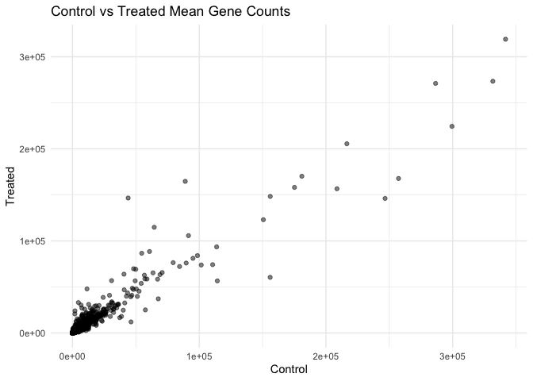
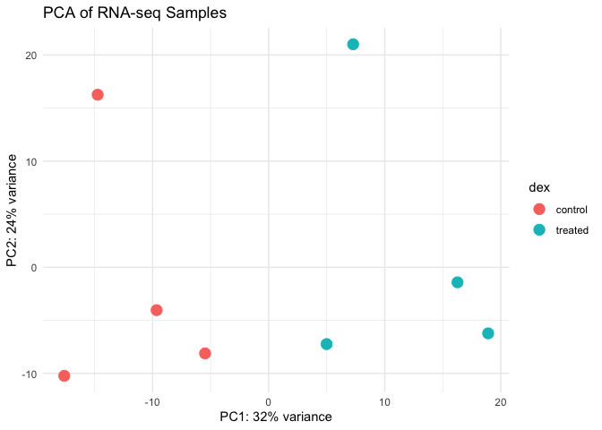
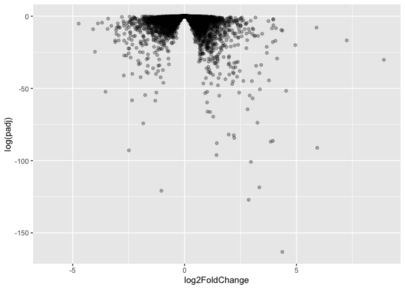
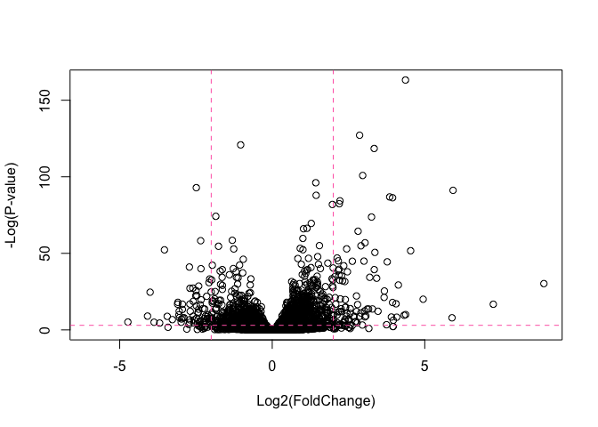
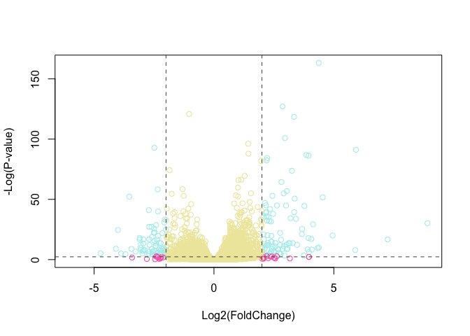

# Class 13: Transcriptomics and the Analysis of RNA-Seq Data
Anisa Mody (PID: A19145291)

- [Background](#background)
- [Data Import](#data-import)
- [Setting up DESeq2](#setting-up-deseq2)
- [PCA Analysis](#pca-analysis)
- [DESeq Analysis](#deseq-analysis)
- [Volcano Plot](#volcano-plot)
- [Save Our Results to Date](#save-our-results-to-date)
- [Adding Annotation Data](#adding-annotation-data)
- [Pathway Analysis](#pathway-analysis)
- [Save Our Annotated Results](#save-our-annotated-results)

## Background

Today we will be performing an RNASeq analysis of a data set on the
common glucocorticoid steroid, dexamethasone (dex), and we’ll use DESeq
for this analysis.

## Data Import

Let’s read the `count` data dna `metadata` about this experiment setup
from the supplied CSV files:

``` r
counts <- read.csv("airway_scaledcounts.csv", row.names=1)
metadata <- read.csv("airway_metadata.csv")
```

Take a peak at the data:

``` r
head(counts)
```

                    SRR1039508 SRR1039509 SRR1039512 SRR1039513 SRR1039516
    ENSG00000000003        723        486        904        445       1170
    ENSG00000000005          0          0          0          0          0
    ENSG00000000419        467        523        616        371        582
    ENSG00000000457        347        258        364        237        318
    ENSG00000000460         96         81         73         66        118
    ENSG00000000938          0          0          1          0          2
                    SRR1039517 SRR1039520 SRR1039521
    ENSG00000000003       1097        806        604
    ENSG00000000005          0          0          0
    ENSG00000000419        781        417        509
    ENSG00000000457        447        330        324
    ENSG00000000460         94        102         74
    ENSG00000000938          0          0          0

And the metadata that tells us what is actually in the columns of our
`counts` object:

``` r
head(metadata)
```

              id     dex celltype     geo_id
    1 SRR1039508 control   N61311 GSM1275862
    2 SRR1039509 treated   N61311 GSM1275863
    3 SRR1039512 control  N052611 GSM1275866
    4 SRR1039513 treated  N052611 GSM1275867
    5 SRR1039516 control  N080611 GSM1275870
    6 SRR1039517 treated  N080611 GSM1275871

> Question 1. How many genes are in this dataset?

There are 38694 genes in this dataset.

> Question 2. How many `control` cell lines do we have?

``` r
sum(metadata$dex == "control")
```

    [1] 4

Or we can also use `table()`:

``` r
table(metadata$dex)
```


    control treated 
          4       4 

``` r
ncol(counts)
```

    [1] 8

``` r
colnames(counts) == metadata$id
```

    [1] TRUE TRUE TRUE TRUE TRUE TRUE TRUE TRUE

``` r
metadata
```

              id     dex celltype     geo_id
    1 SRR1039508 control   N61311 GSM1275862
    2 SRR1039509 treated   N61311 GSM1275863
    3 SRR1039512 control  N052611 GSM1275866
    4 SRR1039513 treated  N052611 GSM1275867
    5 SRR1039516 control  N080611 GSM1275870
    6 SRR1039517 treated  N080611 GSM1275871
    7 SRR1039520 control  N061011 GSM1275874
    8 SRR1039521 treated  N061011 GSM1275875

- Find the “control” columns in our `counts` object
- Extract just the “control” column values for all genes
- Calculate the average value per gene in these “control” columns

``` r
control.inds <- metadata$dex == "control"
control.counts <- counts[ ,control.inds]
control.mean <- rowMeans(control.counts)
```

``` r
head(control.mean)
```

    ENSG00000000003 ENSG00000000005 ENSG00000000419 ENSG00000000457 ENSG00000000460 
             900.75            0.00          520.50          339.75           97.25 
    ENSG00000000938 
               0.75 

Perform the same three steps for the treated columns:

``` r
metadata$dex == "treated"
```

    [1] FALSE  TRUE FALSE  TRUE FALSE  TRUE FALSE  TRUE

> Question 3. How would you make the above code in either approach more
> robust? Is there a function that could help here?

You could make the code more robust by avoiding hard-coded column
positions or manual calculations, since those can break if the sample
order changes. A helpful function here is rowMeans(), which can
calculate the average counts across selected columns more safely and
clearly.

``` r
control.mean <- rowMeans(counts[, metadata$dex == "control"])
treated.mean <- rowMeans(counts[, metadata$dex == "treated"])
```

> Question 4. Follow the same procedure for the treated samples
> (i.e. calculate the mean per gene across drug treated samples and
> assign to a labeled vector called treated.mean)

``` r
treated.inds <- metadata$dex == "treated"
treated.counts <- counts[ ,treated.inds]
treated.mean <- rowMeans(treated.counts)
head(treated.mean)
```

    ENSG00000000003 ENSG00000000005 ENSG00000000419 ENSG00000000457 ENSG00000000460 
             658.00            0.00          546.00          316.50           78.75 
    ENSG00000000938 
               0.00 

``` r
dim(counts)
```

    [1] 38694     8

``` r
dim(metadata)
```

    [1] 8 4

``` r
colnames(counts)
```

    [1] "SRR1039508" "SRR1039509" "SRR1039512" "SRR1039513" "SRR1039516"
    [6] "SRR1039517" "SRR1039520" "SRR1039521"

``` r
metadata$id
```

    [1] "SRR1039508" "SRR1039509" "SRR1039512" "SRR1039513" "SRR1039516"
    [6] "SRR1039517" "SRR1039520" "SRR1039521"

``` r
# Find sample IDs shared by both files
common_ids <- intersect(colnames(counts), metadata$id)

common_ids
```

    [1] "SRR1039508" "SRR1039509" "SRR1039512" "SRR1039513" "SRR1039516"
    [6] "SRR1039517" "SRR1039520" "SRR1039521"

``` r
length(common_ids)
```

    [1] 8

``` r
# Subset countData and metadata to matching samples only
countData <- counts[, common_ids]

metadata <- metadata[match(common_ids, metadata$id), ]

rownames(metadata) <- metadata$id

# Check that they now match
all(colnames(counts) == rownames(metadata))
```

    [1] TRUE

``` r
all(colnames(counts) == rownames(metadata))
```

    [1] TRUE

> Question 5a. Create a scatter plot showing the mean of the treated
> samples against the mean of the control samples. Your plot should look
> something like the following. Now, make a plot of `control.mean` vs
> `treated.mean`

``` r
meancounts <- data.frame(control.mean, treated.mean)
plot(meancounts[,1],meancounts[,2], xlab="Control", ylab="Treated")
```


> Question 5b. You could also use the ggplot2 package to make this
> figure producing the plot below. What geom\_?() function would you use
> for this plot?

`geom(point)` can be used:

``` r
library(ggplot2)

meancounts <- data.frame(control.mean, treated.mean)

ggplot(meancounts, aes(x = control.mean, y = treated.mean)) +
  geom_point(alpha = 0.5) +
  xlab("Control") +
  ylab("Treated") +
  ggtitle("Control vs Treated Mean Gene Counts") +
  theme_minimal()
```



> Question 6. Try plotting both axes on a log scale. What is the
> argument to plot() that allows you to do this? Our count data is
> highly skewed and when we see a pattern like this plot, it screams
> “log transform me!”

``` r
plot(meancounts, log = "xy")
```

    Warning in xy.coords(x, y, xlabel, ylabel, log): 15032 x values <= 0 omitted
    from logarithmic plot

    Warning in xy.coords(x, y, xlabel, ylabel, log): 15281 y values <= 0 omitted
    from logarithmic plot


> Question 7. What is the purpose of the arr.ind argument in the which()
> function call above? Why would we then take the first column of the
> output and need to call the unique() function?

The `arr.ind = TRUE` argument makes `which()` return the row and column
indices of all values meeting the condition in matrix form, rather than
as a single vector of linear positions. We then take the first column to
isolate the gene (row) indices, and use `unique()` because a single gene
may meet the condition in multiple samples, so duplicate row entries
must be removed to count each gene only once.

We most often use log2 to transform for this kind of data in
bioinformatics because

``` r
# Treated / Control

log2(20/40)
```

    [1] -1

We call this little graction the **“log2 fold change”** as it tells us
how much more or less gene expression we have in units of doubling, etc.

Let’s calculate the log2 fold change for our `treated.mean` and
`control.mean` counts and call this `log2fc`

``` r
meancounts$log2fc <- log2(meancounts[,"treated.mean"]/meancounts[,"control.mean"])
head(meancounts)
```

                    control.mean treated.mean      log2fc
    ENSG00000000003       900.75       658.00 -0.45303916
    ENSG00000000005         0.00         0.00         NaN
    ENSG00000000419       520.50       546.00  0.06900279
    ENSG00000000457       339.75       316.50 -0.10226805
    ENSG00000000460        97.25        78.75 -0.30441833
    ENSG00000000938         0.75         0.00        -Inf

A common “rule of thumb” threshold for calling a gene “up regulated” or
“down regulated” is a log2 fold-change value of +2 or -2 (or greater).

``` r
zero.vals <- which(meancounts[,1:2]==0, arr.ind=TRUE)

to.rm <- unique(zero.vals[,1])
mycounts <- meancounts[-to.rm,]
head(mycounts)
```

                    control.mean treated.mean      log2fc
    ENSG00000000003       900.75       658.00 -0.45303916
    ENSG00000000419       520.50       546.00  0.06900279
    ENSG00000000457       339.75       316.50 -0.10226805
    ENSG00000000460        97.25        78.75 -0.30441833
    ENSG00000000971      5219.00      6687.50  0.35769358
    ENSG00000001036      2327.00      1785.75 -0.38194109

``` r
up.ind <- mycounts$log2fc > 2
down.ind <- mycounts$log2fc < (-2)
```

> Question 8. Using the up.ind vector above can you determine how many
> up regulated genes we have at the greater than 2 fc level?

``` r
length(up.ind)
```

    [1] 21817

> Question 9. Using the down.ind vector above can you determine how many
> down regulated genes we have at the greater than 2 fc level?

``` r
length(down.ind)
```

    [1] 21817

> Question 10. Do you trust these results? Why or why not?

These results may not be entirely reliable because they are based only
on fold-change thresholds and do not account for statistical
significance, biological variability, or multiple testing correction.
Without adjusted p-values or false discovery rate control, many
identified genes could represent false positives rather than truly
meaningful differential expression.

## Setting up DESeq2

``` r
library(DESeq2)

dds <- DESeqDataSetFromMatrix(countData=counts, 
                              colData=metadata, 
                              design=~dex)
```

    Warning in DESeqDataSet(se, design = design, ignoreRank): some variables in
    design formula are characters, converting to factors

``` r
dds
```

    class: DESeqDataSet 
    dim: 38694 8 
    metadata(1): version
    assays(1): counts
    rownames(38694): ENSG00000000003 ENSG00000000005 ... ENSG00000283120
      ENSG00000283123
    rowData names(0):
    colnames(8): SRR1039508 SRR1039509 ... SRR1039520 SRR1039521
    colData names(4): id dex celltype geo_id

## PCA Analysis

We can look at how the count data samples are related to one another by
using PCA:

``` r
library(DESeq2)

# Apply a variance stabilizing transformation
vsd <- vst(dds, blind = FALSE)

pcaData <- plotPCA(vsd, intgroup = "dex", returnData = TRUE)

percentVar <- round(100 * attr(pcaData, "percentVar"))

# Build the PCA plot from scratch using the ggplot2 package
library(ggplot2)

# Calculate the PCs and plot the results
ggplot(pcaData, aes(PC1, PC2, color = dex)) +
  geom_point(size = 4) +
  xlab(paste0("PC1: ", percentVar[1], "% variance")) +
  ylab(paste0("PC2: ", percentVar[2], "% variance")) +
  ggtitle("PCA of RNA-seq Samples") +
  theme_minimal()
```



## DESeq Analysis

Let’s do this analysis properly and not forget about the significance of
the differences.

For this we will use the **DESeq2** package

``` r
library(DESeq2)
```

To run a DESeq analysis, we need at least two inputs: - `countData`
i.e. are gene counts across different experiments - `colData` i.e. our
metadata about hose count columns

``` r
library(DESeq2)

dds <- DESeqDataSetFromMatrix(
  countData = round(countData),
  colData = metadata,
  design = ~dex
)
```

    converting counts to integer mode

    Warning in DESeqDataSet(se, design = design, ignoreRank): some variables in
    design formula are characters, converting to factors

``` r
dds <- DESeq(dds)
```

    estimating size factors

    estimating dispersions

    gene-wise dispersion estimates

    mean-dispersion relationship

    final dispersion estimates

    fitting model and testing

Now we can run the DESeq analysis pipeline using this `dds` object that
has all the inputs we need.

``` r
dds <- DESeq(dds)
```

    using pre-existing size factors

    estimating dispersions

    found already estimated dispersions, replacing these

    gene-wise dispersion estimates

    mean-dispersion relationship

    final dispersion estimates

    fitting model and testing

``` r
res <- results(dds)
head(res)
```

    log2 fold change (MLE): dex treated vs control 
    Wald test p-value: dex treated vs control 
    DataFrame with 6 rows and 6 columns
                      baseMean log2FoldChange     lfcSE      stat    pvalue
                     <numeric>      <numeric> <numeric> <numeric> <numeric>
    ENSG00000000003 747.194195      -0.350703  0.168242 -2.084514 0.0371134
    ENSG00000000005   0.000000             NA        NA        NA        NA
    ENSG00000000419 520.134160       0.206107  0.101042  2.039828 0.0413675
    ENSG00000000457 322.664844       0.024527  0.145134  0.168996 0.8658000
    ENSG00000000460  87.682625      -0.147143  0.256995 -0.572550 0.5669497
    ENSG00000000938   0.319167      -1.732289  3.493601 -0.495846 0.6200029
                         padj
                    <numeric>
    ENSG00000000003  0.163017
    ENSG00000000005        NA
    ENSG00000000419  0.175937
    ENSG00000000457  0.961682
    ENSG00000000460  0.815805
    ENSG00000000938        NA

## Volcano Plot

This a ubiquitous and common visualization for this type of data that
puts the log2 foldchange and the adjusted p-value together in one plot
that people can get insight for what is going on in the whole dataset
results.

``` r
library(ggplot2)
```

``` r
ggplot(res) + 
  aes(log2FoldChange, padj) +
  geom_point()
```

    Warning: Removed 23549 rows containing missing values or values outside the scale range
    (`geom_point()`).


This plot is not very useful because we don’t care about genes with high
p-values, we want the very low values below our alpha threshold
(e.g. 0.01).

Let’s log the y-axis so we can see these genes/points more clearly

``` r
ggplot(res) + 
  aes(log2FoldChange, log(padj)) +
  geom_point(alpha = 0.3)
```

    Warning: Removed 23549 rows containing missing values or values outside the scale range
    (`geom_point()`).



``` r
plot( res$log2FoldChange, -log(res$padj), 
      xlab="Log2(FoldChange)",
      ylab="-Log(P-value)")
```


To make this more useful we can add some guidelines (with the abline()
function) and color (with a custom color vector) highlighting genes that
have padj\<0.05 and the absolute log2FoldChange\>2.

``` r
plot( res$log2FoldChange,  -log(res$padj), 
 ylab="-Log(P-value)", xlab="Log2(FoldChange)")

# Add some cut-off lines
abline(v=c(-2,2), col="hotpink", lty=2)
abline(h=-log(0.05), col="hotpink", lty=2)
```



``` r
# Setup our custom point color vector 
mycols <- rep("palegoldenrod", nrow(res))
mycols[ abs(res$log2FoldChange) > 2 ]  <- "hotpink" 

inds <- (res$padj < 0.05) & (abs(res$log2FoldChange) > 2 )
mycols[ inds ] <- "paleturquoise"

# Volcano plot with custom colors 
plot( res$log2FoldChange,  -log(res$padj), 
 col=mycols, ylab="-Log(P-value)", xlab="Log2(FoldChange)" )

# Cut-off lines
abline(v=c(-2,2), col="gray32", lty=2)
abline(h=-log(0.1), col="gray32", lty=2)
```



> Question. Add annotation to this volcano plot including the log2
> fold-change thresholds of +2 and -2 and the p-value hreshold of 0.05.
> Also color up just the genes that meet both of these thresholds, as
> these are the ones we will focus on later.

## Save Our Results to Date

``` r
write.csv(res, file="myresults.csv")
```

## Adding Annotation Data

We need to “map” or “translate” our ENSEMBL gene identifiers in our
results object to date the identifiers used in the different databases
we want to use for learning more about these genes.

For this, we will use a couple of BioConductor packages, that we can
install with: `BiocManager::install("AnnotationDbi")` and
`BiocManager::install("org.Hs.eg.db")`

``` r
library(AnnotationDbi)
library(org.Hs.eg.db)
```

We can see the columns in `org.Hs.eg.db` that list the different
databases we can map between:

``` r
columns(org.Hs.eg.db)
```

     [1] "ACCNUM"       "ALIAS"        "ENSEMBL"      "ENSEMBLPROT"  "ENSEMBLTRANS"
     [6] "ENTREZID"     "ENZYME"       "EVIDENCE"     "EVIDENCEALL"  "GENENAME"    
    [11] "GENETYPE"     "GO"           "GOALL"        "IPI"          "MAP"         
    [16] "OMIM"         "ONTOLOGY"     "ONTOLOGYALL"  "PATH"         "PFAM"        
    [21] "PMID"         "PROSITE"      "REFSEQ"       "SYMBOL"       "UCSCKG"      
    [26] "UNIPROT"     

``` r
head(res)
```

    log2 fold change (MLE): dex treated vs control 
    Wald test p-value: dex treated vs control 
    DataFrame with 6 rows and 6 columns
                      baseMean log2FoldChange     lfcSE      stat    pvalue
                     <numeric>      <numeric> <numeric> <numeric> <numeric>
    ENSG00000000003 747.194195      -0.350703  0.168242 -2.084514 0.0371134
    ENSG00000000005   0.000000             NA        NA        NA        NA
    ENSG00000000419 520.134160       0.206107  0.101042  2.039828 0.0413675
    ENSG00000000457 322.664844       0.024527  0.145134  0.168996 0.8658000
    ENSG00000000460  87.682625      -0.147143  0.256995 -0.572550 0.5669497
    ENSG00000000938   0.319167      -1.732289  3.493601 -0.495846 0.6200029
                         padj
                    <numeric>
    ENSG00000000003  0.163017
    ENSG00000000005        NA
    ENSG00000000419  0.175937
    ENSG00000000457  0.961682
    ENSG00000000460  0.815805
    ENSG00000000938        NA

We can now use the `mapIds()` function to map between these different
database identifier formats:

``` r
res$symbol <- mapIds(org.Hs.eg.db,
                     keys=row.names(res), 
                     keytype="ENSEMBL",
                     column="SYMBOL",
                     multiVals="first")
```

    'select()' returned 1:many mapping between keys and columns

> Question. Can you map to “GENENAME” and add as a new “column” to our
> `res` object?

``` r
res$symbol <- mapIds(org.Hs.eg.db,
                     keys=row.names(res), 
                     keytype="ENSEMBL",
                     column="GENENAME",
                     multiVals="first")
```

    'select()' returned 1:many mapping between keys and columns

> Question. Add “ENTREZID” as `res$entrez`?

``` r
res$entrez <- mapIds(org.Hs.eg.db,
                     keys=row.names(res), 
                     keytype="ENSEMBL",
                     column="ENTREZID",
                     multiVals="first")
```

    'select()' returned 1:many mapping between keys and columns

``` r
head(res)
```

    log2 fold change (MLE): dex treated vs control 
    Wald test p-value: dex treated vs control 
    DataFrame with 6 rows and 8 columns
                      baseMean log2FoldChange     lfcSE      stat    pvalue
                     <numeric>      <numeric> <numeric> <numeric> <numeric>
    ENSG00000000003 747.194195      -0.350703  0.168242 -2.084514 0.0371134
    ENSG00000000005   0.000000             NA        NA        NA        NA
    ENSG00000000419 520.134160       0.206107  0.101042  2.039828 0.0413675
    ENSG00000000457 322.664844       0.024527  0.145134  0.168996 0.8658000
    ENSG00000000460  87.682625      -0.147143  0.256995 -0.572550 0.5669497
    ENSG00000000938   0.319167      -1.732289  3.493601 -0.495846 0.6200029
                         padj                 symbol      entrez
                    <numeric>            <character> <character>
    ENSG00000000003  0.163017          tetraspanin 6        7105
    ENSG00000000005        NA            tenomodulin       64102
    ENSG00000000419  0.175937 dolichyl-phosphate m..        8813
    ENSG00000000457  0.961682 SCY1 like pseudokina..       57147
    ENSG00000000460  0.815805 FIGNL1 interacting r..       55732
    ENSG00000000938        NA FGR proto-oncogene, ..        2268

## Pathway Analysis

Now we have our annotated results with their log2 fold-change and
p-values, so we can figure out which biological pathways and process
these genes are involved with.

We will use the **gage** and **pathview** packages for this step, and we
can install them with:
`BiocManager::install(c("pathview", "gage", "gageData"))`

``` r
library(gage)
library(gageData)
library(pathview)
```

Let’s look at gageData:

``` r
data(kegg.sets.hs)

# Examine the first 2 pathways in this kegg set for humans

head(kegg.sets.hs, 2)
```

    $`hsa00232 Caffeine metabolism`
    [1] "10"   "1544" "1548" "1549" "1553" "7498" "9"   

    $`hsa00983 Drug metabolism - other enzymes`
     [1] "10"     "1066"   "10720"  "10941"  "151531" "1548"   "1549"   "1551"  
     [9] "1553"   "1576"   "1577"   "1806"   "1807"   "1890"   "221223" "2990"  
    [17] "3251"   "3614"   "3615"   "3704"   "51733"  "54490"  "54575"  "54576" 
    [25] "54577"  "54578"  "54579"  "54600"  "54657"  "54658"  "54659"  "54963" 
    [33] "574537" "64816"  "7083"   "7084"   "7172"   "7363"   "7364"   "7365"  
    [41] "7366"   "7367"   "7371"   "7372"   "7378"   "7498"   "79799"  "83549" 
    [49] "8824"   "8833"   "9"      "978"   

We need a named vector of gene IDs in the correct format
(e.g. fold-change values) that has gene IDs as names. These names need
to be in the correct format (using the correct database format for the
IDs).

``` r
x <- c(10, 9, 7)
names <- (x <- c("alice", "chandra", "barry"))
x
```

    [1] "alice"   "chandra" "barry"  

Here we will make a small input vector called `foldchanges` that has
“entrez” IDs as the names:

``` r
foldchanges <- res$log2FoldChange
names(foldchanges) <- res$entrez
```

Now we can run `gage()` to do our pathway analysis.

``` r
keggres = gage(foldchanges, gsets=kegg.sets.hs)
```

``` r
attributes(keggres)
```

    $names
    [1] "greater" "less"    "stats"  

``` r
head(keggres$less, 3)
```

                                          p.geomean stat.mean        p.val
    hsa05332 Graft-versus-host disease 0.0004250607 -3.473335 0.0004250607
    hsa04940 Type I diabetes mellitus  0.0017820379 -3.002350 0.0017820379
    hsa05310 Asthma                    0.0020046180 -3.009045 0.0020046180
                                            q.val set.size         exp1
    hsa05332 Graft-versus-host disease 0.09053792       40 0.0004250607
    hsa04940 Type I diabetes mellitus  0.14232788       42 0.0017820379
    hsa05310 Asthma                    0.14232788       29 0.0020046180

Now we can use the **Pathview** package with the found KEGG pathway IDs
(e.g. “hsa05310” for the Asthma pathways) to make a pathway figure
showing our Differential Expressed Genes (DEGs)

``` r
library(pathview)
```

``` r
pathview(gene.data=foldchanges, pathway.id="hsa05310")
```

    'select()' returned 1:1 mapping between keys and columns

    Info: Working in directory /Users/anisa/BIMM 143/bimm143/class13

    Info: Writing image file hsa05310.pathview.png


## Save Our Annotated Results

``` r
write.csv(res, file="myresults_annotated.csv")
```
