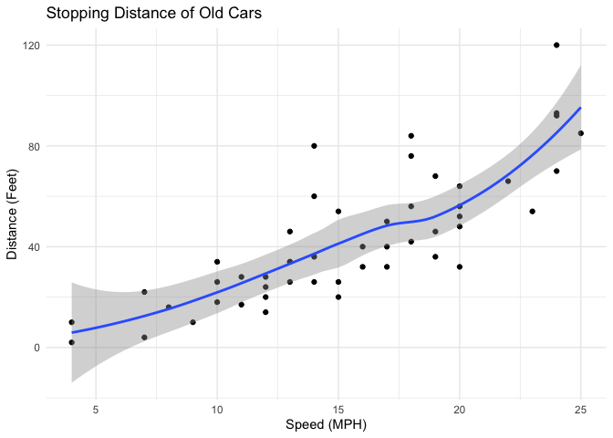
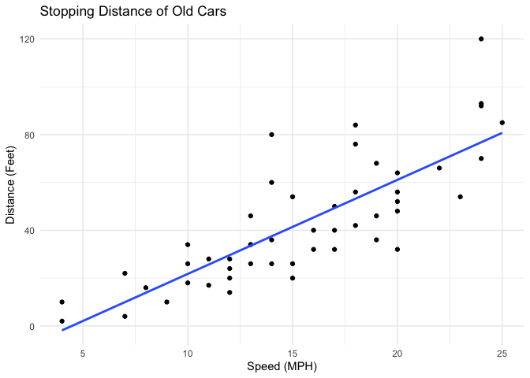
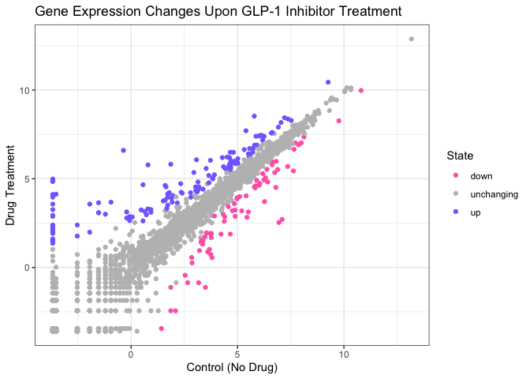
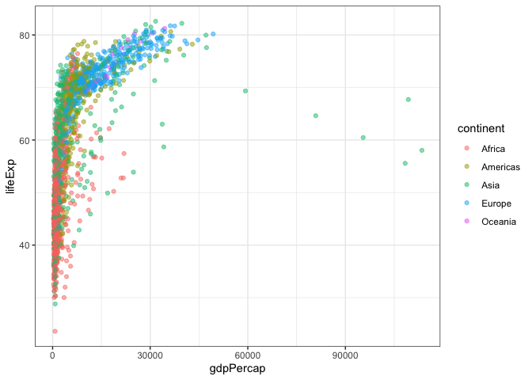
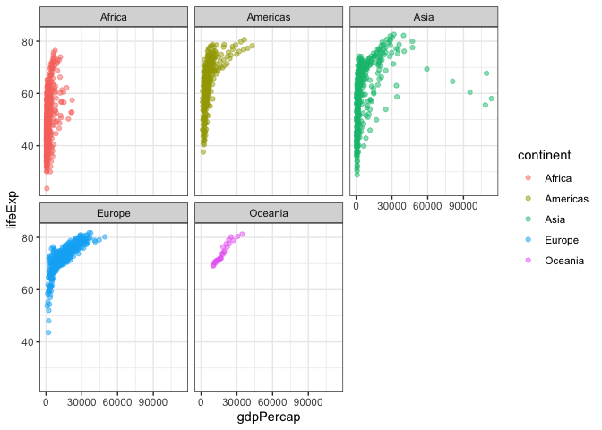
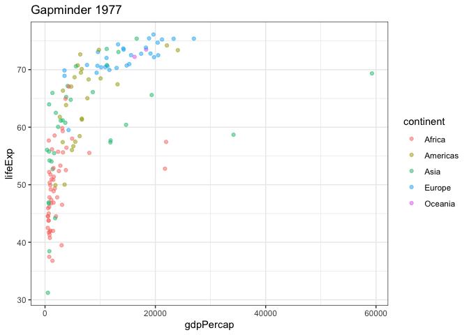
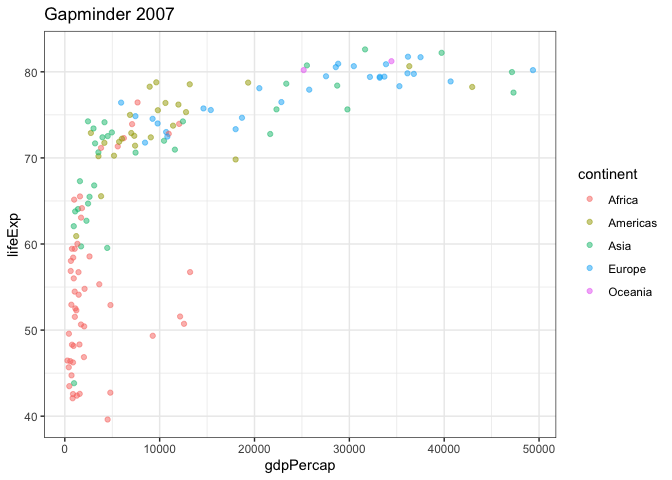
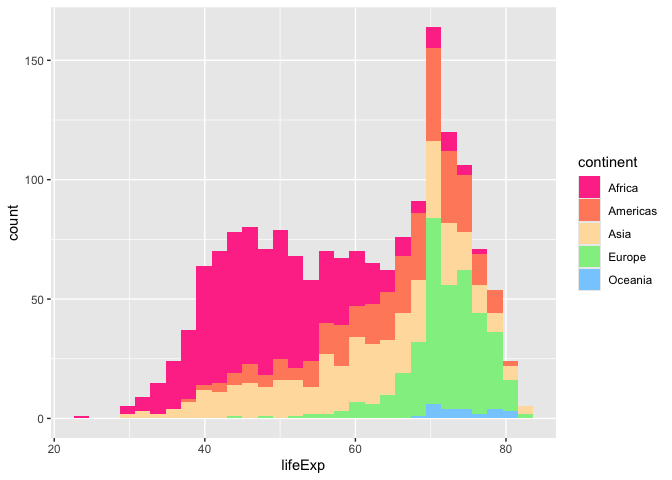

# Class 5: Data Viz with ggplot2
Anisa Mody (PID: A19145291)

- [Background](#background)
- [Add some custom features to the
  plot](#add-some-custom-features-to-the-plot)
- [Gene Expression Figure](#gene-expression-figure)
- [Going Further](#going-further)

## Background

There are many graphics systems in R for making plots and figures. These
include so-called *base R graphics* like the `plot()` function and add
on packages like **ggplot2**.

Let’s compare how we make a simple figure with these two systems:

We can use the in-built `cars` dataset:

``` r
head(cars)
```

      speed dist
    1     4    2
    2     4   10
    3     7    4
    4     7   22
    5     8   16
    6     9   10

``` r
plot(cars)
```


Before I can use ggplot2, I need to install it on my computer. To do
this, we can use the function `install.packages("ggplot2")`

> **N.B.** We never run `install.packages()` in our quarto doc (we only
> run it once in our R console) as it would re-install the package every
> time we render our quarto report.

Once installed, we need to load up the package into our R brain:

``` r
library(ggplot2)
```

The main function in the **ggplot2** package is called `ggplot()`

``` r
ggplot(cars)
```


Every ggplot has at least 3 layers:

- First Layer: the **data** (a data.frame of the stuff we want to plot)
- Second Layer: the **aes**thetics (how the data maps to the plot)
- Third Layer: the **geom** layer (how you want the plot drawn,
  e.g. points, lines, bars, etc.)

``` r
ggplot(cars) +
  aes(x = speed, y = dist) +
  geom_point()
```


## Add some custom features to the plot

Let’s add a trend line that shows the relationship between speed and
distance.

``` r
ggplot(cars) +
  aes(x = speed, y = dist) +
  geom_point() +
  geom_smooth() +
  theme_minimal() +
  labs(title = "Stopping Distance of Old Cars", x = "Speed (MPH)", y = "Distance (Feet)")
```

    `geom_smooth()` using method = 'loess' and formula = 'y ~ x'



Q. Can you make the `geom_smooth()` function produce a linear line of
best fit for the data and turn off the “gray” error region?

``` r
ggplot(cars) +
  aes(x = speed, y = dist) +
  geom_point() +
  geom_smooth(method = "lm", se = FALSE) +
  theme_minimal() +
  labs(title = "Stopping Distance of Old Cars", x = "Speed (MPH)", y = "Distance (Feet)")
```

    `geom_smooth()` using formula = 'y ~ x'



------------------------------------------------------------------------

## Gene Expression Figure

Import the data to plot.

``` r
url <- "https://bioboot.github.io/bimm143_S20/class-material/up_down_expression.txt"
genes <- read.delim(url)
head(genes)
```

            Gene Condition1 Condition2      State
    1      A4GNT -3.6808610 -3.4401355 unchanging
    2       AAAS  4.5479580  4.3864126 unchanging
    3      AASDH  3.7190695  3.4787276 unchanging
    4       AATF  5.0784720  5.0151916 unchanging
    5       AATK  0.4711421  0.5598642 unchanging
    6 AB015752.4 -3.6808610 -3.5921390 unchanging

``` r
sum(genes$State == "up")
```

    [1] 127

A useful new function in this context is the `table()` function:

``` r
table(genes$State)
```


          down unchanging         up 
            72       4997        127 

Initial Plot

``` r
ggplot(genes) +
  aes(Condition1, Condition2, col = State) +
  geom_point()
```


Modified Plot

``` r
ggplot(genes) +
  aes(Condition1, Condition2, col = State) +
  geom_point() +
  theme_bw() +
  labs(title = "Gene Expression Changes Upon GLP-1 Inhibitor Treatment", x = "Control (No Drug)", y = "Drug Treatment") + 
  scale_color_manual(values = c("hotpink", "gray", "slateblue1"))
```



## Going Further

Here we read the famous gapminder dataset:

``` r
# File location online
url <- "https://raw.githubusercontent.com/jennybc/gapminder/master/inst/extdata/gapminder.tsv"

gapminder <- read.delim(url)
head(gapminder)
```

          country continent year lifeExp      pop gdpPercap
    1 Afghanistan      Asia 1952  28.801  8425333  779.4453
    2 Afghanistan      Asia 1957  30.332  9240934  820.8530
    3 Afghanistan      Asia 1962  31.997 10267083  853.1007
    4 Afghanistan      Asia 1967  34.020 11537966  836.1971
    5 Afghanistan      Asia 1972  36.088 13079460  739.9811
    6 Afghanistan      Asia 1977  38.438 14880372  786.1134

> Q. How many entries (i.e. rows) are in this dataset?

``` r
nrow(gapminder)
```

    [1] 1704

> Q. How many different “country” entries are in this dataset?

``` r
length(table(gapminder$country))
```

    [1] 142

``` r
length(unique(gapminder$country))
```

    [1] 142

Let’s make our first plot of the entire dataset:

Plot of “gdpPercap” vs “lifeExp” colored by “continent”

``` r
p <- ggplot(gapminder) +
  aes(x = gdpPercap, y = lifeExp, col = continent) +
  geom_point(alpha=0.5) +
  theme_bw()
```

``` r
p
```



I can add more layers to `p`, which is my base plot.

``` r
p +
  facet_wrap(~gapminder$continent)
```



Make a plot for 1977 and 2007 only (not all the years in the dataset).

First use the **dplyr** package and the `filter()` function from that
package to extract the year 2007.

``` r
library(dplyr)
```


    Attaching package: 'dplyr'

    The following objects are masked from 'package:stats':

        filter, lag

    The following objects are masked from 'package:base':

        intersect, setdiff, setequal, union

``` r
gapminder_1977 <- filter(gapminder, year==1977)
ggplot(gapminder_1977) +
  aes(x = gdpPercap, y = lifeExp, col = continent) +
  geom_point(alpha=0.5) +
  theme_bw() +
  labs(title = "Gapminder 1977")
```



``` r
gapminder_2007 <- filter(gapminder, year==2007)
ggplot(gapminder_2007) +
  aes(x = gdpPercap, y = lifeExp, col = continent) +
  geom_point(alpha=0.5) +
  theme_bw() +
  labs(title = "Gapminder 2007")
```



> Q. Make a histogram of lifeExp colored by continent

``` r
ggplot(gapminder, aes(x = lifeExp, fill = continent)) +
  geom_histogram(bins = 30) + 
  scale_fill_manual(values = c("violetred1", "salmon1", "navajowhite1", "lightgreen", "skyblue1"))
```



> Q. Make a histogram of lifeExp faceted by continent

``` r
ggplot(gapminder, aes(x = lifeExp)) +
  geom_histogram(bins = 30) +
  facet_wrap(~ continent)
```


