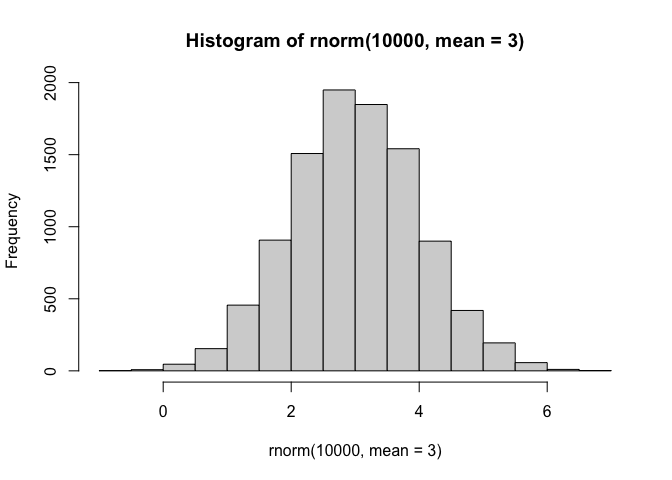
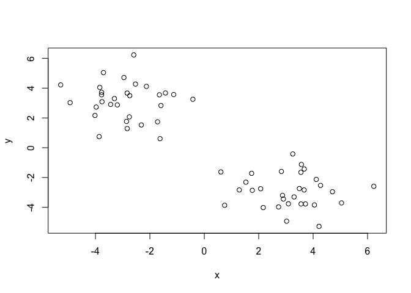
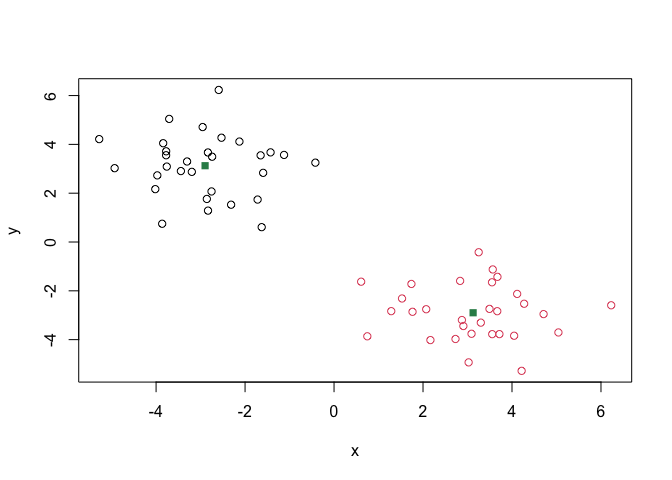
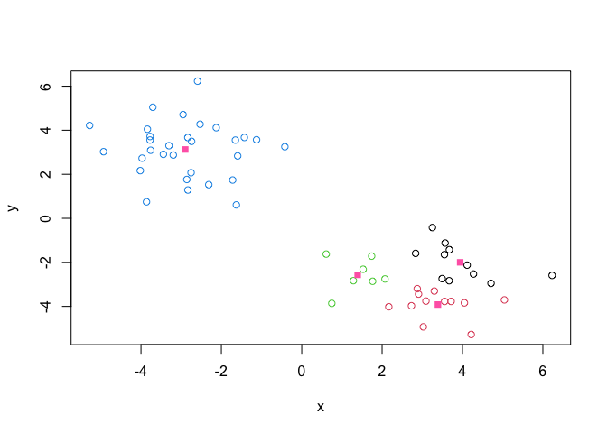
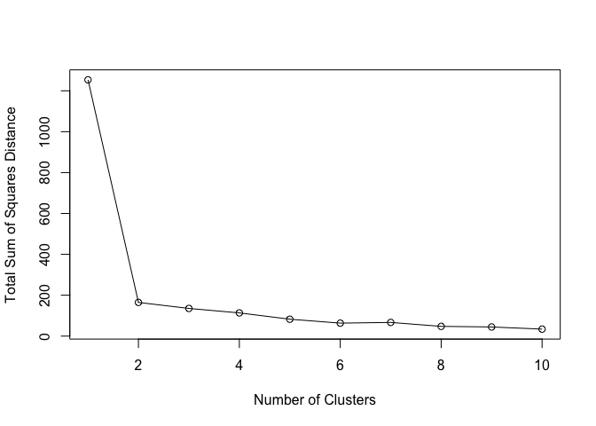
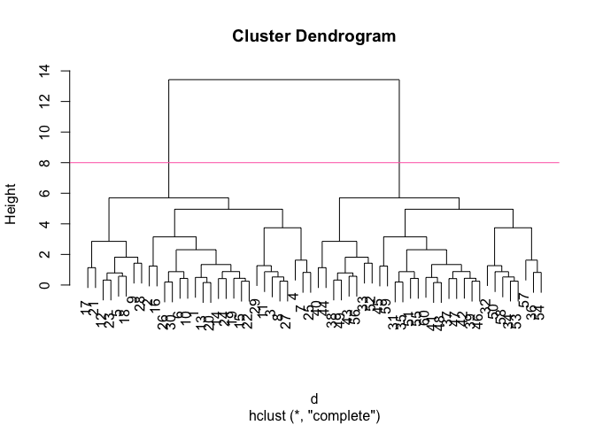
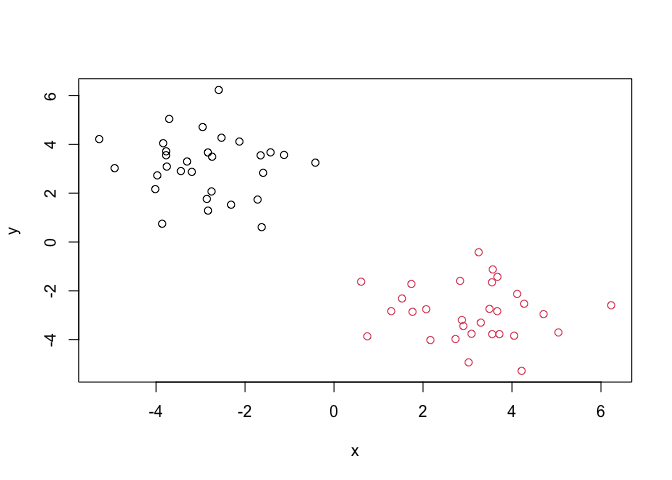
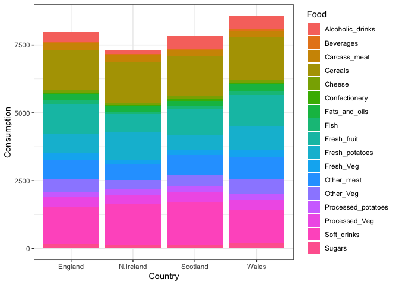
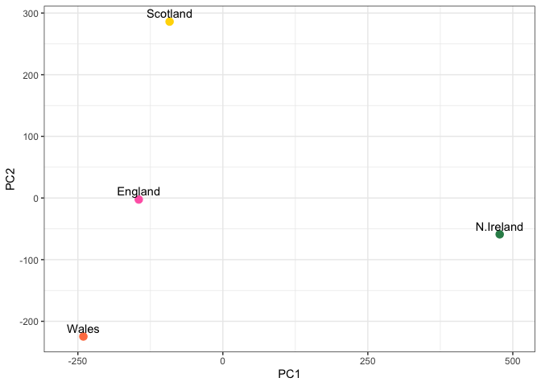
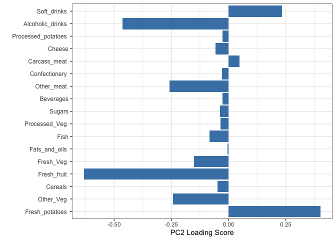

# Class 7: Machine Learning 1
Anisa Mody (PID: A19145291)

- [Hierarchical Clustering](#hierarchical-clustering)
- [Principal Component Analysis
  (PCA)](#principal-component-analysis-pca)
- [Analysis of UK Food Data](#analysis-of-uk-food-data)

\##Background

Today, we will explore some core machine learning methods that are very
popular in bioinformatics. These include **clustering** and
**dimensionallity reduction**.

\##K-means Clustering

The main function in “base” R for K-means clustering is called
`kmeans()`.

Before we go too deep let’s make up some “simple” data that we can
cluster and know if we are getting a good answer or not. To do this, we
can use the `rnorm()` function:

``` r
hist(rnorm(10000, mean = 3))
```



``` r
x <- c( rnorm(30, -3), rnorm(30, +3) )
x
```

     [1] -3.8404828 -5.2785097 -1.1237767 -2.5920636 -2.3137069 -2.5298367
     [7] -2.9530999 -1.4267388 -4.0179592 -2.1269515 -1.5935844 -2.8590813
    [13] -3.7734035 -3.7596343 -3.4421540 -4.9316544 -1.7181908 -2.8326285
    [19] -3.3033462 -3.7745476 -1.6259838 -3.1964681 -2.7536899 -3.9726149
    [25] -3.7054895 -2.8343963 -1.6502577 -3.8630889 -0.4196028 -2.7400425
    [31]  3.4940473  3.2512367  0.7477899  3.5507100  3.6683616  5.0432930
    [37]  2.7301036  2.0715328  2.8739659  0.6091165  3.5549852  3.2991578
    [43]  1.2857557  1.7392558  3.0249934  2.9067195  3.0903655  3.7169018
    [49]  1.7639735  2.8336003  4.1155568  2.1661736  3.6726078  4.7098768
    [55]  4.2730007  1.5283218  6.2297613  3.5673199  4.2164903  4.0478477

``` r
#rev(x)
z <- cbind(x=x, y=rev(x))
plot(z)
```



Now we can run `kmeans()` on this input `z` and see what the results
look like.

``` r
km <- kmeans(z, centers = 2)
km
```

    K-means clustering with 2 clusters of sizes 30, 30

    Cluster means:
              x         y
    1 -2.898433  3.126094
    2  3.126094 -2.898433

    Clustering vector:
     [1] 1 1 1 1 1 1 1 1 1 1 1 1 1 1 1 1 1 1 1 1 1 1 1 1 1 1 1 1 1 1 2 2 2 2 2 2 2 2
    [39] 2 2 2 2 2 2 2 2 2 2 2 2 2 2 2 2 2 2 2 2 2 2

    Within cluster sum of squares by cluster:
    [1] 82.39745 82.39745
     (between_SS / total_SS =  86.9 %)

    Available components:

    [1] "cluster"      "centers"      "totss"        "withinss"     "tot.withinss"
    [6] "betweenss"    "size"         "iter"         "ifault"      

> Question: How many points are in each section?

``` r
km$size
```

    [1] 30 30

> Question: What component of your result object details cluster
> assignment/membership?

``` r
km$cluster
```

     [1] 1 1 1 1 1 1 1 1 1 1 1 1 1 1 1 1 1 1 1 1 1 1 1 1 1 1 1 1 1 1 2 2 2 2 2 2 2 2
    [39] 2 2 2 2 2 2 2 2 2 2 2 2 2 2 2 2 2 2 2 2 2 2

> Question: What component of your result object details cluster center?

``` r
km$centers
```

              x         y
    1 -2.898433  3.126094
    2  3.126094 -2.898433

> Plot `z` colored by the kmeans cluster assignment and add cluster
> centers as blue points

``` r
plot(z, col=c(km$cluster))
points(km$centers, col="seagreen", pch=15)
```



> Question: Run a K-means clustering and plot the results asking for 4
> clusters

``` r
km4 <- kmeans(z, centers = 4)
plot(z, col=km4$cluster)
points(km4$center, col="hotpink", pch=15)
```



> **N.B.** You need to tell K-means the number of clusters (i.e. set
> `centers=2`)

One approach is to try different values for `centers` and then pick the
best…

``` r
ans <- NULL
for(i in 1:10){
km <- kmeans(z, centers=i)
ans <- c(ans, km$tot.withinss)
}

plot(ans,typ="o",
     xlab="Number of Clusters",
     ylab="Total Sum of Squares Distance")
```



## Hierarchical Clustering

The main function in “base” R for Hierarchical Clustering is called
`hclust()`.

This function does not take your “raw” data for clustering. You must
first build a “distance matrix” from your data and pass this as input to
`hclust()`.

``` r
d <- dist(z)
hc <- hclust(d)
hc
```


    Call:
    hclust(d = d)

    Cluster method   : complete 
    Distance         : euclidean 
    Number of objects: 60 

There is a bespoke `plot()` method for `hclust()` result objects.

``` r
plot(hc)
abline(h=8,col="hotpink")
```



Once we have our `hclust` object (our “tree” of “cluster dendrogram”) we
can *“cut”* the tree to reveal the clustering pattern.

``` r
cutree(hc, k=4)
```

     [1] 1 1 1 1 2 1 1 1 2 1 1 2 1 1 1 1 2 2 1 1 2 1 2 1 1 1 1 2 1 1 3 3 4 3 3 3 3 4
    [39] 3 4 3 3 4 4 3 3 3 3 4 3 3 4 3 3 3 4 3 3 3 3

> Question: Make a plot of `z` with your hclust results (i.e. colored by
> cluster membership)

``` r
grps <- cutree(hc, k=2)
plot(z, col=grps)
```



## Principal Component Analysis (PCA)

PCA is a dimensionallity reduction method that is popular for revealing
patterns in complex datasets

## Analysis of UK Food Data

Let’s look at some data on the eating habits of the people from the UK
to see if there are patterns and trends that have some regions being
distinct from others.

Read in the data:

The data is made available in CSV format so we can use the `read(csv)`
function to import it to R:

``` r
url <- "https://tinyurl.com/UK-foods"
x <- read.csv(url)
x
```

                         X England Wales Scotland N.Ireland
    1               Cheese     105   103      103        66
    2        Carcass_meat      245   227      242       267
    3          Other_meat      685   803      750       586
    4                 Fish     147   160      122        93
    5       Fats_and_oils      193   235      184       209
    6               Sugars     156   175      147       139
    7      Fresh_potatoes      720   874      566      1033
    8           Fresh_Veg      253   265      171       143
    9           Other_Veg      488   570      418       355
    10 Processed_potatoes      198   203      220       187
    11      Processed_Veg      360   365      337       334
    12        Fresh_fruit     1102  1137      957       674
    13            Cereals     1472  1582     1462      1494
    14           Beverages      57    73       53        47
    15        Soft_drinks     1374  1256     1572      1506
    16   Alcoholic_drinks      375   475      458       135
    17      Confectionery       54    64       62        41

Tidy the Data: Fix anything that went wrong with the data

> Question 1. How many rows and columns are in your new data frame named
> x? What R functions could you use to answer this questions?

``` r
## Complete the following code to find out how many rows and columns are in x?
nrow(x)
```

    [1] 17

``` r
ncol(x)
```

    [1] 5

``` r
dim(x)
```

    [1] 17  5

``` r
## Preview the first 6 rows
head(x)
```

                   X England Wales Scotland N.Ireland
    1         Cheese     105   103      103        66
    2  Carcass_meat      245   227      242       267
    3    Other_meat      685   803      750       586
    4           Fish     147   160      122        93
    5 Fats_and_oils      193   235      184       209
    6         Sugars     156   175      147       139

``` r
# Note how the minus indexing works
rownames(x) <- x[,1]
x <- x[,-1]
head(x)
```

                   England Wales Scotland N.Ireland
    Cheese             105   103      103        66
    Carcass_meat       245   227      242       267
    Other_meat         685   803      750       586
    Fish               147   160      122        93
    Fats_and_oils      193   235      184       209
    Sugars             156   175      147       139

``` r
dim(x)
```

    [1] 17  4

``` r
x <- read.csv(url, row.names=1)
head(x)
```

                   England Wales Scotland N.Ireland
    Cheese             105   103      103        66
    Carcass_meat       245   227      242       267
    Other_meat         685   803      750       586
    Fish               147   160      122        93
    Fats_and_oils      193   235      184       209
    Sugars             156   175      147       139

> Question 2. Which approach to solving the ‘row-names problem’
> mentioned above do you prefer and why? Is one approach more robust
> than another under certain circumstances?

I prefer converting row names into an explicit column because it keeps
the data in a tidy format and works better with newer tools like `dplyr`
and `ggplot2`. This approach is more transparent and avoids issues where
row names are lost or ignored during data transformations. It is usually
more robust than relying on row names, specifically when merging,
reshaping, or exporting data.

Exploratory Analysis: Make some plots to help make sense of obvious
trends…

``` r
barplot(as.matrix(x), beside=T, col=rainbow(nrow(x)))
```


> Question 3. Changing what optional argument in the above barplot()
> function results in the following plot?

Changing the `beside` argument to false will result in a stacked plot
instead.

``` r
barplot(as.matrix(x), beside=F, col=rainbow(nrow(x)))
```


``` r
library(tidyr)
library(ggplot2)
```

``` r
# Convert the data to “long” format
x_long <- x |> 
          tibble::rownames_to_column("Food") |> 
          pivot_longer(cols = -Food, 
                       names_to = "Country", 
                       values_to = "Consumption")

dim(x_long)
```

    [1] 68  3

``` r
head(x_long)
```

    # A tibble: 6 × 3
      Food            Country   Consumption
      <chr>           <chr>           <int>
    1 "Cheese"        England           105
    2 "Cheese"        Wales             103
    3 "Cheese"        Scotland          103
    4 "Cheese"        N.Ireland          66
    5 "Carcass_meat " England           245
    6 "Carcass_meat " Wales             227

``` r
ggplot(x_long) +
  aes(x = Country, y = Consumption, fill = Food) +
  geom_col(position = "dodge") +
  theme_bw()
```


> Question 4. Changing what optional argument in the above ggplot() code
> results in a stacked barplot figure?

Changing the `position` argument in the code will result in a stacked
barplot figure.

``` r
ggplot(x_long) +
  aes(x = Country, y = Consumption, fill = Food) +
  geom_col(position = "stack") +
  theme_bw()
```



> Question 5. We can use the pairs() function to generate all pairwise
> plots for our countries. Can you make sense of the following code and
> resulting figure? What does it mean if a given point lies on the
> diagonal for a given plot?

The `pairs()` plot shows scatterplots for every pair of variables,
allowing you to see relationships between food consumption categories
across countries. Points on the diagonal represent each variable plotted
against itself, so they form a straight line and don’t provide
meaningful comparison information. These diagonal panels mainly serve as
labels, while the off-diagonal plots reveal correlations between
different variables.

``` r
pairs(x, col=rainbow(nrow(x)), pch=16)
```


``` r
library(pheatmap)

pheatmap(as.matrix(x))
```


> Question 6. Based on the pairs and heatmap figures, which countries
> cluster together and what does this suggest about their food
> consumption patterns? Can you easily tell what the main differences
> between N. Ireland and the other countries of the UK in terms of this
> data-set?

From the pairs and heatmap plots, England, Wales, and Scotland tend to
cluster together, indicating similar food consumption patterns. Northern
Ireland appears more distinct, suggesting its consumption habits differ
from the other regions. The main differences are not immediately obvious
from a single plot, but the heatmap highlights variations in specific
food categories more clearly.

> **Key Point**: Even relatively small datasets can prove challenging to
> interpret.

PCA: The main function in “base” R for PCA is called `prcomp()`. This
function wants the “observations” to be rows and the “variables” to be
columns.

So here we need to take the transpose of our `x` input object.

``` r
pca <- prcomp(t(x))
summary(pca)
```

    Importance of components:
                                PC1      PC2      PC3       PC4
    Standard deviation     324.1502 212.7478 73.87622 2.921e-14
    Proportion of Variance   0.6744   0.2905  0.03503 0.000e+00
    Cumulative Proportion    0.6744   0.9650  1.00000 1.000e+00

The returned `pca` object has components that we can use to make our
main result figures:

``` r
attributes(pca)
```

    $names
    [1] "sdev"     "rotation" "center"   "scale"    "x"       

    $class
    [1] "prcomp"

The main result figure from this analysis is called a **“PC score
plot”** (a.k.a an “ordenation plot” “PC plot” or “PC1 vs PC2 plot”).

This plot shows how samples (in this case countries) relate to each
other along our new PC axis

> Question 7. Complete the code below to generate a plot of PC1 vs PC2.
> The second line adds text labels over the data points.

This is our new “reduced-dimensional space”. In this case 2 dimension
PC1 and PC2, that capture most of the variance in the original data set.

``` r
# Create a data frame for plotting
ggplot(pca$x) +
  aes(x = PC1, y = PC2, label = rownames(pca$x)) +
  geom_point(size = 3) +
  geom_text(vjust = -0.5) +
  xlim(-270, 500) +
  xlab("PC1") +
  ylab("PC2") +
  theme_bw()
```


> Question 8. Customize your plot so that the colors of the country
> names match the colors in our UK and Ireland map and table at start of
> this document.

``` r
# Make a color vector with one color per row/sample
mycols <- c("hotpink", "coral", "gold", "seagreen")

# Make a new PCA plot
ggplot(pca$x) +
  aes(x = PC1, y = PC2, label = rownames(pca$x)) +
  geom_point(size = 3, col = mycols) +
  geom_text(vjust = -0.5) +
  xlim(-270, 500) +
  xlab("PC1") +
  ylab("PC2") +
  theme_bw()
```



Below we can use the square of pca\$sdev , which stands for “standard
deviation”, to calculate how much variation in the original data each PC
accounts for.

``` r
v <- round( pca$sdev^2/sum(pca$sdev^2) * 100 )
v
```

    [1] 67 29  4  0

``` r
## or the second row here...
z <- summary(pca)
z$importance
```

                                 PC1       PC2      PC3          PC4
    Standard deviation     324.15019 212.74780 73.87622 2.921348e-14
    Proportion of Variance   0.67444   0.29052  0.03503 0.000000e+00
    Cumulative Proportion    0.67444   0.96497  1.00000 1.000000e+00

**Scree Plot with ggplot**

``` r
# Create scree plot with ggplot
variance_df <- data.frame(
  PC = factor(paste0("PC", 1:length(v)), levels = paste0("PC", 1:length(v))),
  Variance = v
)

ggplot(variance_df) +
  aes(x = PC, y = Variance) +
  geom_col(fill = "steelblue") +
  xlab("Principal Component") +
  ylab("Percent Variation") +
  theme_bw() +
  theme(axis.text.x = element_text(angle = 0))
```


``` r
## Lets focus on PC1 as it accounts for > 90% of variance 
ggplot(pca$rotation) +
  aes(x = PC1, 
      y = reorder(rownames(pca$rotation), PC1)) +
  geom_col(fill = "steelblue") +
  xlab("PC1 Loading Score") +
  ylab("") +
  theme_bw() +
  theme(axis.text.y = element_text(size = 9))
```


> Question 9. Generate a similar ‘loadings plot’ for PC2. What two food
> groups feature prominantely and what does PC2 maninly tell us about?

``` r
ggplot(pca$rotation) +
  aes(x = PC1, 
      y = reorder(rownames(pca$rotation), PC2)) +
  geom_col(fill = "steelblue") +
  xlab("PC2 Loading Score") +
  ylab("") +
  theme_bw() +
  theme(axis.text.y = element_text(size = 9))
```



The PC2 loadings plot typically shows strong contributions from food
groups like fresh vegetables and fresh fruit. These variables stand out
because they have larger positive or negative loading values compared to
others. PC2 mainly captures variation related to healthier or fresh food
consumption patterns across the countries.

Additionally, the PC score plot shows how the observations (countries)
are positioned relative to each other based on the principal components.
The loadings plot shows which variables (food groups) are driving those
principal component directions. By comparing them, you can interpret why
certain countries appear where they do in the score plot based on the
variables that have strong influence in the loadings plot.
