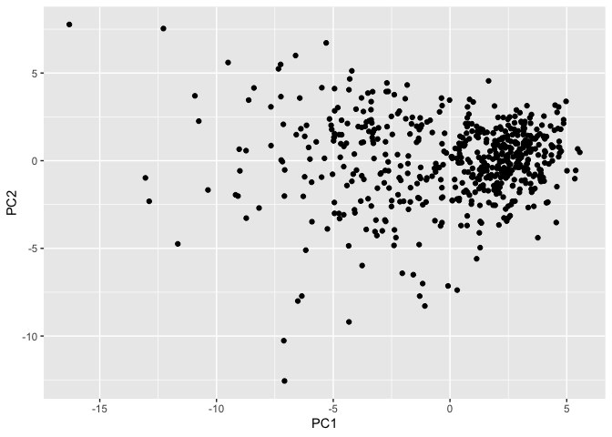
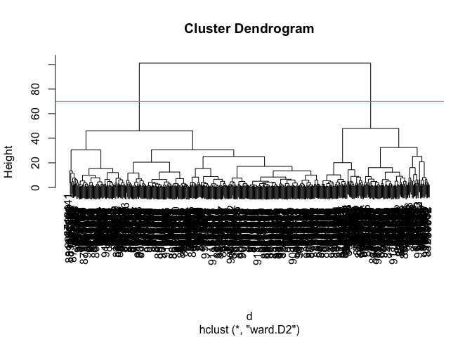
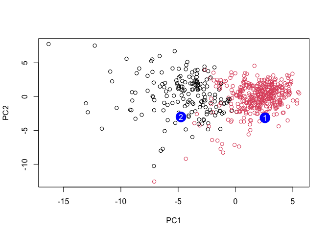

# Class 8: Breast Cancer Mini Project
Anisa Mody (PID: A19145291)

- [Background](#background)
- [Data Import](#data-import)
- [Exploratory Data Analysis](#exploratory-data-analysis)
- [Principal Component Analysis
  (PCA)](#principal-component-analysis-pca)
- [Hierarchical Clustering](#hierarchical-clustering)
- [Combining Methods](#combining-methods)
- [Prediction](#prediction)

## Background

The goal of this mini-project is for you to explore a complete analysis
using the unsupervised learning techniques covered in class.

Today, we will analyze a biopsy data set from a fine needle aspiration
(FNA) of a breast mass that describe characteristics of the cell nuclei
present in digitized images.

## Data Import

This data is made available as a CSV file for download. We can read this
in using `read.csv()`:

``` r
# Read in the Wisconsin breast cancer data from the CSV file
fna.data <- "WisconsinCancer.csv"

# Load the CSV file into R, using the first column as row names
wisc.df <- read.csv(fna.data, row.names=1)

# Preview the first 3 rows of the dataset
head(wisc.df, 3)
```

             diagnosis radius_mean texture_mean perimeter_mean area_mean
    842302           M       17.99        10.38          122.8      1001
    842517           M       20.57        17.77          132.9      1326
    84300903         M       19.69        21.25          130.0      1203
             smoothness_mean compactness_mean concavity_mean concave.points_mean
    842302           0.11840          0.27760         0.3001             0.14710
    842517           0.08474          0.07864         0.0869             0.07017
    84300903         0.10960          0.15990         0.1974             0.12790
             symmetry_mean fractal_dimension_mean radius_se texture_se perimeter_se
    842302          0.2419                0.07871    1.0950     0.9053        8.589
    842517          0.1812                0.05667    0.5435     0.7339        3.398
    84300903        0.2069                0.05999    0.7456     0.7869        4.585
             area_se smoothness_se compactness_se concavity_se concave.points_se
    842302    153.40      0.006399        0.04904      0.05373           0.01587
    842517     74.08      0.005225        0.01308      0.01860           0.01340
    84300903   94.03      0.006150        0.04006      0.03832           0.02058
             symmetry_se fractal_dimension_se radius_worst texture_worst
    842302       0.03003             0.006193        25.38         17.33
    842517       0.01389             0.003532        24.99         23.41
    84300903     0.02250             0.004571        23.57         25.53
             perimeter_worst area_worst smoothness_worst compactness_worst
    842302             184.6       2019           0.1622            0.6656
    842517             158.8       1956           0.1238            0.1866
    84300903           152.5       1709           0.1444            0.4245
             concavity_worst concave.points_worst symmetry_worst
    842302            0.7119               0.2654         0.4601
    842517            0.2416               0.1860         0.2750
    84300903          0.4504               0.2430         0.3613
             fractal_dimension_worst
    842302                   0.11890
    842517                   0.08902
    84300903                 0.08758

Make sure we remove or exclude the `diagnosis` column from the data set
that we use for further analysis - this is the expert diagnosis as
either M or B:

``` r
# Remove the diagnosis column so PCA only uses numeric measurement variables
wisc.data <- wisc.df[,-1]

# Save the diagnosis labels as a separate factor variable
diagnosis <- as.factor(wisc.df$diagnosis)
```

## Exploratory Data Analysis

> Question 1. How many observations are in this dataset?

``` r
# Count the number of observations in the dataset
nrow(wisc.data)
```

    [1] 569

> Question 2. How many of the observations have a malignant diagosis?

``` r
# Count how many samples are benign or malignant
table(wisc.df$diagnosis)
```


      B   M 
    357 212 

> Question 3. How many variables/features in this data are suffixed with
> `_mean`?

We can use the `grep()` function to help us here:

``` r
# Show all column names in the numeric cancer dataset
colnames(wisc.data)
```

     [1] "radius_mean"             "texture_mean"           
     [3] "perimeter_mean"          "area_mean"              
     [5] "smoothness_mean"         "compactness_mean"       
     [7] "concavity_mean"          "concave.points_mean"    
     [9] "symmetry_mean"           "fractal_dimension_mean" 
    [11] "radius_se"               "texture_se"             
    [13] "perimeter_se"            "area_se"                
    [15] "smoothness_se"           "compactness_se"         
    [17] "concavity_se"            "concave.points_se"      
    [19] "symmetry_se"             "fractal_dimension_se"   
    [21] "radius_worst"            "texture_worst"          
    [23] "perimeter_worst"         "area_worst"             
    [25] "smoothness_worst"        "compactness_worst"      
    [27] "concavity_worst"         "concave.points_worst"   
    [29] "symmetry_worst"          "fractal_dimension_worst"

``` r
# Count how many variables end with "_mean"
length(grep("_mean", colnames(wisc.data), value = T))
```

    [1] 10

## Principal Component Analysis (PCA)

We need to scale our data before PCA with the `scale=TRUE` argument to
`prcomp()`.

``` r
# Run PCA on the numeric data and scale variables first
wisc.pr <- prcomp(wisc.data, scale=TRUE)

# Display a summary of variance explained by each principal component
summary(wisc.pr)
```

    Importance of components:
                              PC1    PC2     PC3     PC4     PC5     PC6     PC7
    Standard deviation     3.6444 2.3857 1.67867 1.40735 1.28403 1.09880 0.82172
    Proportion of Variance 0.4427 0.1897 0.09393 0.06602 0.05496 0.04025 0.02251
    Cumulative Proportion  0.4427 0.6324 0.72636 0.79239 0.84734 0.88759 0.91010
                               PC8    PC9    PC10   PC11    PC12    PC13    PC14
    Standard deviation     0.69037 0.6457 0.59219 0.5421 0.51104 0.49128 0.39624
    Proportion of Variance 0.01589 0.0139 0.01169 0.0098 0.00871 0.00805 0.00523
    Cumulative Proportion  0.92598 0.9399 0.95157 0.9614 0.97007 0.97812 0.98335
                              PC15    PC16    PC17    PC18    PC19    PC20   PC21
    Standard deviation     0.30681 0.28260 0.24372 0.22939 0.22244 0.17652 0.1731
    Proportion of Variance 0.00314 0.00266 0.00198 0.00175 0.00165 0.00104 0.0010
    Cumulative Proportion  0.98649 0.98915 0.99113 0.99288 0.99453 0.99557 0.9966
                              PC22    PC23   PC24    PC25    PC26    PC27    PC28
    Standard deviation     0.16565 0.15602 0.1344 0.12442 0.09043 0.08307 0.03987
    Proportion of Variance 0.00091 0.00081 0.0006 0.00052 0.00027 0.00023 0.00005
    Cumulative Proportion  0.99749 0.99830 0.9989 0.99942 0.99969 0.99992 0.99997
                              PC29    PC30
    Standard deviation     0.02736 0.01153
    Proportion of Variance 0.00002 0.00000
    Cumulative Proportion  1.00000 1.00000

``` r
# Loads ggplot2 for plotting
library(ggplot2)

#Plot PC1 against PC2
ggplot(wisc.pr$x) +
  aes(PC1, PC2) +
  geom_point()
```



> Question 4. From your results, what proportion of the original
> variance is captured by the first principal component (PC1)?

``` r
# Calculate the variance for each principal component
summary(wisc.pr)$importance[2, 1]
```

    [1] 0.44272

> Question 5. How many principal components (PCs) are required to
> describe at least 70% of the original variance in the data?

``` r
which(summary(wisc.pr)$importance[3, ] >= 0.70)[1]
```

    PC3 
      3 

> Question 6. How many principal components (PCs) are required to
> describe at least 90% of the original variance in the data?

``` r
which(summary(wisc.pr)$importance[3, ] >= 0.90)[1]
```

    PC7 
      7 

> Question 7. What stands out to you about this plot? Is it easy or
> difficult to understand? Why?

``` r
biplot(wisc.pr)
```


The plot is very cluttered, with many overlapping points and variable
arrows, making it hard to read. It’s difficult to clearly distinguish
patterns or individual observations because of the excessive labeling.
While it contains useful information, the overall complexity makes it
challenging to interpret quickly.

> Question 8. Generate a similar plot for principal components 1 and 3.
> What do you notice about these plots?

``` r
# Plot PC1 against PC2
ggplot(wisc.pr$x) +
  aes(PC1, PC3, col = diagnosis) +
  geom_point()
```


The PC1 vs PC2 plot typically shows a clearer separation between
diagnosis groups, while the PC1 vs PC3 plot shows less distinct
separation. This indicates that PC2 captures more of the variation
relevant to distinguishing the groups than PC3 does.

**Variance**

``` r
# Calculate the variance for each principal component
pr.var <- wisc.pr$sdev^2

#View the first few variance values
head(pr.var)
```

    [1] 13.281608  5.691355  2.817949  1.980640  1.648731  1.207357

``` r
# Variance explained by each principal component: pve
pve <- pr.var / sum(pr.var)

# Plot variance explained for each principal component
plot(c(1,pve), xlab = "Principal Component", 
     ylab = "Proportion of Variance Explained", 
     ylim = c(0, 1), type = "o")
```


``` r
# Alternative scree plot of the same data, note data driven y-axis
barplot(pve, ylab = "Percent of Variance Explained",
     names.arg=paste0("PC",1:length(pve)), las=2, axes = FALSE)
axis(2, at=pve, labels=round(pve,2)*100 )
```


``` r
## ggplot based graph
#install.packages("factoextra")
library(factoextra)
```

    Welcome to factoextra!

    Want to learn more? See two factoextra-related books at https://www.datanovia.com/en/product/practical-guide-to-principal-component-methods-in-r/

``` r
fviz_eig(wisc.pr, addlabels = TRUE)
```


> Question 9. For the first principal component, what is the component
> of the loading vector (i.e. wisc.pr\$rotation\[,1\]) for the feature
> concave.points_mean? This tells us how much this original feature
> contributes to the first PC. Are there any features with larger
> contributions than this one?

``` r
wisc.pr$rotation["concave.points_mean", 1]
```

    [1] -0.2608538

``` r
# Sort loadings by magnitude (largest first)
sort(abs(wisc.pr$rotation[,1]), decreasing = TRUE)[1:5]
```

     concave.points_mean       concavity_mean concave.points_worst 
               0.2608538            0.2584005            0.2508860 
        compactness_mean      perimeter_worst 
               0.2392854            0.2366397 

``` r
sort(abs(wisc.pr$rotation[,1]), decreasing = TRUE)
```

        concave.points_mean          concavity_mean    concave.points_worst 
                 0.26085376              0.25840048              0.25088597 
           compactness_mean         perimeter_worst         concavity_worst 
                 0.23928535              0.23663968              0.22876753 
               radius_worst          perimeter_mean              area_worst 
                 0.22799663              0.22753729              0.22487053 
                  area_mean             radius_mean            perimeter_se 
                 0.22099499              0.21890244              0.21132592 
          compactness_worst               radius_se                 area_se 
                 0.21009588              0.20597878              0.20286964 
          concave.points_se          compactness_se            concavity_se 
                 0.18341740              0.17039345              0.15358979 
            smoothness_mean           symmetry_mean fractal_dimension_worst 
                 0.14258969              0.13816696              0.13178394 
           smoothness_worst          symmetry_worst           texture_worst 
                 0.12795256              0.12290456              0.10446933 
               texture_mean    fractal_dimension_se  fractal_dimension_mean 
                 0.10372458              0.10256832              0.06436335 
                symmetry_se              texture_se           smoothness_se 
                 0.04249842              0.01742803              0.01453145 

The loading for concave.points_mean on PC1 can be obtained with
`wisc.pr$rotation["concave.points_mean", 1]`, and it has a relatively
large value, indicating it strongly contributes to PC1. However, when
comparing all loadings, there are a few features with even larger
absolute values. This means that while it is important, it is not the
single strongest contributor to PC1.

## Hierarchical Clustering

> Question 10. Using the `plot()` and `abline()` functions, what is the
> height at which the clustering model has 4 clusters?

``` r
# Scale the wisc.data data using the "scale()" function
data.scaled <- scale(wisc.data)

# Calculate Euclidean distances between all samples
data.dist <- dist(data.scaled)

# Perform hierarchical clustering using complete linkage
wisc.hclust <- hclust(data.dist, method = "complete")

# Plot the clustering dendrogram
plot(wisc.hclust)
```


``` r
# Scale the wisc.data data using the "scale()" function
data.scaled <- scale(wisc.data)

# Calculate Euclidean distances between all samples
data.dist <- dist(data.scaled)

# Perform hierarchical clustering using complete linkage
wisc.hclust <- hclust(data.dist, method = "complete")

# Plot the clustering dendrogram
plot(wisc.hclust)

# Add a horizontal line around height 19, which gives about 4 clusters
abline(h = 19, col = "red", lty = 2)
```


> Question 12. Which method gives your favorite results for the same
> data.dist dataset? Explain your reasoning.

``` r
# Cluster using the first 7 principal components, which explain over 90% variance
wisc.pr.hclust <- hclust(dist(wisc.pr$x[, 1:7]), method = "ward.D2")

# Cut the PCA-based dendrogram into 2 clusters
wisc.pr.hclust.clusters <- cutree(wisc.pr.hclust, k = 2)

# Compare PCA-based clusters to the expert diagnosis
table(wisc.pr.hclust.clusters, diagnosis)
```

                           diagnosis
    wisc.pr.hclust.clusters   B   M
                          1  28 188
                          2 329  24

I prefer ward.D2 because it minimizes within-cluster variance, which
produces tighter and more compact clusters. In this dataset, it results
in clearer separation between benign and malignant samples compared to
complete linkage. Complete linkage usually forms more irregular clusters
and shows weaker alignment with the known diagnoses.

## Combining Methods

``` r
# Calculate the distance matrix using the first four principal components
d <- dist(wisc.pr$x[,1:4])

# Run hierarchical clustering on the PCA distance matrix using Ward's method
wisc.pr.hclust <- hclust(d, method = "ward.D2") 

# Plot the hierarchical clustering dendrogram
plot(wisc.pr.hclust)

#Add a horizontal line at height 70 to show where the tree can be cut into groups
abline(h=70, col="hotpink")
```



``` r
grps <- cutree(wisc.pr.hclust, h=70)
table(grps)
```

    grps
      1   2 
    171 398 

How does this clustering `grps` correspond to the expert `diagnosis`?

``` r
table(diagnosis)
```

    diagnosis
      B   M 
    357 212 

``` r
table(diagnosis, grps)
```

             grps
    diagnosis   1   2
            B   6 351
            M 165  47

``` r
# Plot PC1 against PC2 with the points colored based on a vector `grps`
ggplot(wisc.pr$x) +
aes(PC1, PC2) +
geom_point(col=grps)
```


**Clustering on PCA Results**

> Question 13. How well does the newly created hclust model with two
> clusters separate out the two “M” and “B” diagnoses?

``` r
# Compare the original hierarchical clustering result to diagnosis
table(wisc.pr.hclust.clusters, diagnosis)
```

                           diagnosis
    wisc.pr.hclust.clusters   B   M
                          1  28 188
                          2 329  24

> Question 14. How well do the hierarchical clustering models you
> created in the previous sections (i.e. without first doing PCA) do in
> terms of separating the diagnoses? Again, use the table() function to
> compare the output of each model (wisc.hclust.clusters and
> wisc.pr.hclust.clusters) with the vector containing the actual
> diagnoses.

``` r
# Create clusters from the scaled-data hierarchical clustering model
wisc.hclust.clusters <- cutree(wisc.hclust, k = 4)

# Compare the non-PCA hierarchical clustering groups to the actual diagnoses
table(wisc.hclust.clusters, diagnosis)
```

                        diagnosis
    wisc.hclust.clusters   B   M
                       1  12 165
                       2   2   5
                       3 343  40
                       4   0   2

``` r
# Compare the PCA-based clustering groups to the actual diagnoses again
table(grps, diagnosis)
```

        diagnosis
    grps   B   M
       1   6 165
       2 351  47

The hierarchical clustering without PCA separates the diagnoses less
effectively, with several clusters containing a mix of both benign and
malignant samples. In contrast, the PCA-based clustering shows clearer
grouping, with clusters more strongly dominated by one diagnosis type.
This suggests that using PCA before clustering improves separation by
reducing noise and focusing on the most informative variation in the
data.

## Prediction

``` r
# Save the URL for the new patient samples
url <- "https://tinyurl.com/new-samples-CSV"

# Read the new patient samples into R
new <- read.csv(url)

# Project the new samples into the existing PCA model
npc <- predict(wisc.pr, newdata=new)
npc
```

               PC1       PC2        PC3        PC4       PC5        PC6        PC7
    [1,]  2.576616 -3.135913  1.3990492 -0.7631950  2.781648 -0.8150185 -0.3959098
    [2,] -4.754928 -3.009033 -0.1660946 -0.6052952 -1.140698 -1.2189945  0.8193031
                PC8       PC9       PC10      PC11      PC12      PC13     PC14
    [1,] -0.2307350 0.1029569 -0.9272861 0.3411457  0.375921 0.1610764 1.187882
    [2,] -0.3307423 0.5281896 -0.4855301 0.7173233 -1.185917 0.5893856 0.303029
              PC15       PC16        PC17        PC18        PC19       PC20
    [1,] 0.3216974 -0.1743616 -0.07875393 -0.11207028 -0.08802955 -0.2495216
    [2,] 0.1299153  0.1448061 -0.40509706  0.06565549  0.25591230 -0.4289500
               PC21       PC22       PC23       PC24        PC25         PC26
    [1,]  0.1228233 0.09358453 0.08347651  0.1223396  0.02124121  0.078884581
    [2,] -0.1224776 0.01732146 0.06316631 -0.2338618 -0.20755948 -0.009833238
                 PC27        PC28         PC29         PC30
    [1,]  0.220199544 -0.02946023 -0.015620933  0.005269029
    [2,] -0.001134152  0.09638361  0.002795349 -0.019015820

``` r
# Plot original samples using PC1 and PC2, colored by cluster group
plot(wisc.pr$x[,1:2], col=grps)

# Add the new samples as large blue points
points(npc[,1], npc[,2], col="blue", pch=16, cex=3)

# Label the new samples as 1 and 2
text(npc[,1], npc[,2], c(1,2), col="white")
```



> Question 16. Which of these new patients should we prioritize for
> follow up based on your results?

Sample 2 should be prioritized for follow-up because it lies within or
closest to the cluster of malignant samples in the PCA plot. This
suggests it shares similar characteristics with known cancerous cases.
In contrast, sample 1 appears closer to the benign cluster and is
therefore less concerning.
